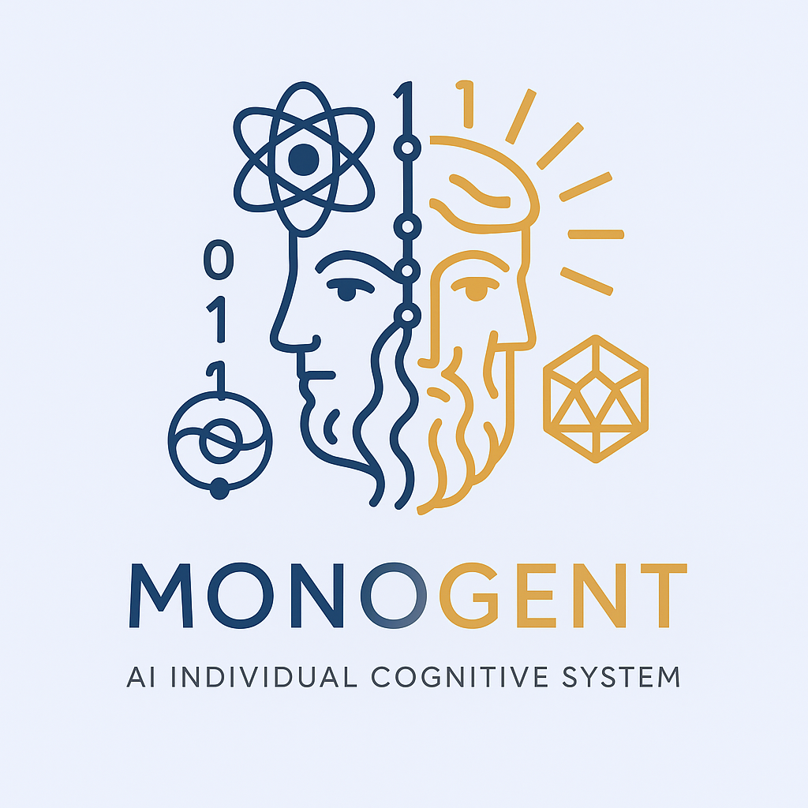

<div align="center">
  
  
  # Monogent
  
  A cognitive architecture system that models human cognition through composable cognitive functions and processes, inspired by cognitive psychology and neuroscience.
</div>

## Overview

Monogent implements a biologically-inspired cognitive architecture that simulates how the human mind processes information - from raw sensory input to deep understanding. The system is built on the principle that cognition emerges from the composition of simpler cognitive operations, mirroring the modular organization of the human brain.

## Core Concepts

### Experience Chain
Every cognitive operation produces an `Experience` - a moment of cognition that links to previous experiences, forming a chain of cognitive history. This allows the system to trace how understanding develops through successive transformations.

```typescript
interface Experience<T> {
  value: T                      // The cognitive content
  source?: string              // How this experience was created
  context?: unknown            // Additional metadata
  previous?: Experience<any>   // Link to previous experience
}
```

### Evolution System
Cognitive transformations are modeled as `Evolution` - the process by which one experience evolves into another. We distinguish between:

- **Micro-evolution (Process level)**: Small transformations within a cognitive stage
- **Macro-evolution (Function level)**: Major transitions that produce new experiences
- **Path-evolution**: Complete cognitive journeys from input to understanding

### Substrate Architecture
Two fundamental substrates power all cognitive operations:

- **Computation Substrate**: Handles deterministic, algorithmic transformations (like pattern matching)
- **Generation Substrate**: Handles creative, probabilistic operations (like language understanding)

## Architecture

```
┌─────────────────────────────────────────────────────────────┐
│                        Cognition System                       │
├─────────────────────────────────────────────────────────────┤
│                           Paths                               │
│  ┌─────────────────────────────────────────────────────┐    │
│  │ understand: sensation → perception → comprehension → │    │
│  │            familiarity → recollection → consolidation│    │
│  └─────────────────────────────────────────────────────┘    │
├─────────────────────────────────────────────────────────────┤
│                         Functions                             │
│  ┌──────────┐ ┌───────────┐ ┌──────────────┐ ┌──────────┐  │
│  │Sensation │ │Perception │ │Comprehension │ │Familiarity│  │
│  └──────────┘ └───────────┘ └──────────────┘ └──────────┘  │
├─────────────────────────────────────────────────────────────┤
│                         Processes                             │
│  ┌────────────┐ ┌─────────────┐ ┌───────────────┐          │
│  │Transduction│ │FeatureDetect│ │SemanticEncode │ ...      │
│  └────────────┘ └─────────────┘ └───────────────┘          │
├─────────────────────────────────────────────────────────────┤
│                         Substrates                            │
│  ┌─────────────────────┐    ┌─────────────────────┐         │
│  │    Computation      │    │    Generation       │         │
│  └─────────────────────┘    └─────────────────────┘         │
└─────────────────────────────────────────────────────────────┘
```

## Current Progress

### ✅ Completed
- **Core Interfaces**: Experience, Evolution, Substrate system
- **Architecture Design**: Micro/macro evolution distinction
- **Composition System**: Smart EvolutionComposer with type-based strategies
- **Basic Processes**: Transduction, SensoryGating, ExperientialEncoding
- **All Functions**: Defined with proper theoretical foundations
- **Understand Path**: Complete cognitive pipeline from sensation to consolidation

### 🚧 In Progress
- **Generation Processes**: Implementing LLM-based cognitive operations
- **Computation Processes**: Building deterministic transformations
- **Memory System**: Hippocampus integration for memory storage/retrieval

### 📋 Planned
- **Additional Paths**: think, learn, create, decide
- **Cognitive Tests**: Replicating classic cognitive psychology experiments
- **Performance Optimization**: Batching LLM calls, caching strategies
- **Real-world Applications**: Practical use cases and demos

## When Complete

Monogent will be a fully functional cognitive system capable of:

1. **Understanding**: Processing input through multiple cognitive stages to achieve deep comprehension
2. **Learning**: Forming new memories and integrating them with existing knowledge
3. **Thinking**: Internal reasoning without external input
4. **Creating**: Generating novel ideas through cognitive recombination
5. **Deciding**: Making choices based on cognitive evaluation

The system will serve as:
- A research platform for cognitive science
- A practical framework for building cognitive applications
- A bridge between symbolic AI and neural approaches
- A testbed for theories of mind and consciousness

## Installation

```bash
# Clone the repository
git clone https://github.com/Deepractice/Monogent.git

# Install dependencies
pnpm install

# Build the project
pnpm build
```

## Usage

```typescript
import { understand } from '@monogent/cognition'
import { experientialEncoding } from '@monogent/cognition/processes'

// Encode raw input into an Experience
const input = experientialEncoding.evolve("The cat sat on the mat")

// Process through the understand path
const understanding = await understand.evolve(input)

// Trace the cognitive journey
let current = understanding
while (current) {
  console.log(`${current.source}: ${current.value}`)
  current = current.previous
}
```

## Project Structure

```
Monogent/
├── packages/              # Core packages
│   ├── cognition/        # Cognitive architecture
│   │   ├── src/
│   │   │   ├── interfaces/      # Core interfaces
│   │   │   │   ├── substrate/   # Computation & Generation
│   │   │   │   ├── processes/   # Cognitive processes
│   │   │   │   ├── functions/   # Cognitive functions
│   │   │   │   └── paths/       # Cognitive paths
│   │   │   └── scripts/         # Test scripts
│   │   └── examples/            # Usage examples
│   ├── hippocampus/      # Memory system
│   ├── cortex/           # LLM integration
│   └── logger/           # Logging utilities
├── apps/                 # Applications
├── docs/                 # Documentation
└── scripts/              # Build scripts
```

## Technical Stack

- **Runtime**: Node.js 20+
- **Language**: TypeScript 5.3+
- **Package Manager**: pnpm workspace
- **Build System**: Turbo + tsup
- **Testing**: Vitest
- **Code Quality**: ESLint 9 + Prettier

## Contributing

We welcome contributions! Please see our [Contributing Guide](CONTRIBUTING.md) for details.

## License

MIT © Deepractice

## Recommended Reading

To understand the theoretical foundations and design philosophy behind Monogent, we recommend reading our article series:

1. [**RAG is Not All You Need**](docs/articles/en/1-RAG-not-all-en.md) - Why traditional RAG falls short and the need for true cognitive systems
2. [**Why Can't Semantics Be Computed?**](docs/articles/en/2-Why-cant-semantics-be-computed-en.md) - The five dimensions of semantic computability
3. [**Learning from Human Cognition**](docs/articles/en/3-Learning-from-human-cognition-en.md) - How cognitive psychology informs our architecture

---

> "Individual cognitive systems surpass RAG. The key is the five-dimensional computability of semantics." - Sean