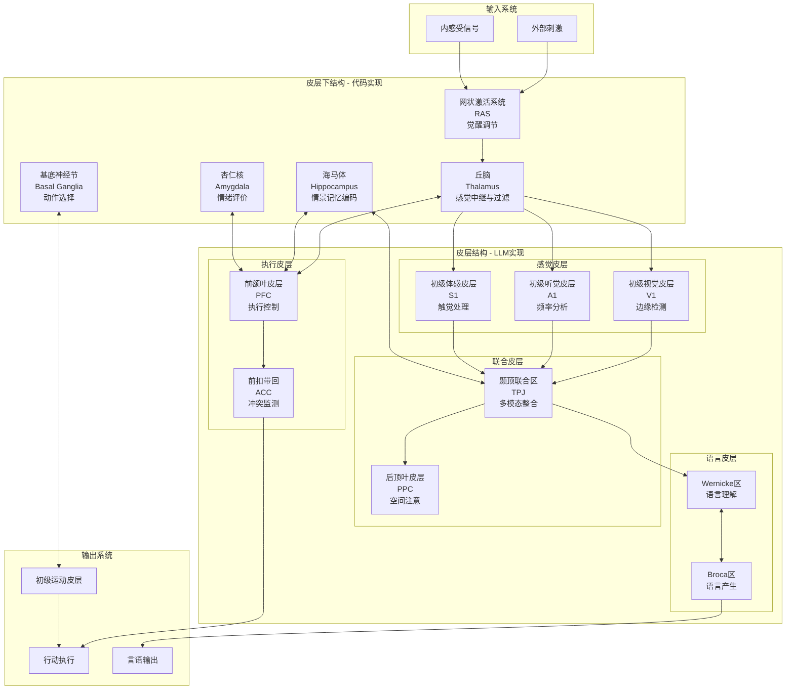

# Monogent 认知架构设计

## 核心设计原则

### 1. 神经科学锚定原则

**严格遵循脑科学和认知心理学理论**

- 每个组件直接对应神经解剖结构
- 使用标准神经科学术语命名
- 功能定义基于已验证的神经机制

### 2. 二元分离原则

**皮层下结构与皮层结构的计算分离**

- **皮层下结构**：物理计算、确定性 → 代码实现
- **皮层结构**：语义理解、概率性 → LLM 实现

### 3. 可验证性原则

**架构错误可通过对照神经科学发现**

- 组件功能可与神经科学文献对照
- 信息流可与神经通路对比
- 计算机制可与认知理论验证

## 神经系统架构

> **实现说明**：
> - 皮层下结构（RAS、丘脑、海马体、杏仁核、基底神经节）→ 代码实现
> - 皮层结构（所有皮层区域）→ LLM 实现



## 认知功能映射

| 神经结构 | 认知功能 | 计算特征 | Monogent实现 |
|----------|----------|----------|--------------|
| **皮层下结构** ||||
| 网状激活系统 (RAS) | 觉醒调节、意识水平 | 全局调制、阈值控制 | 代码：激活度控制 |
| 丘脑 (Thalamus) | 感觉门控、注意力过滤 | 物理阈值、抑制性 | 代码：信号过滤算法 |
| 海马体 (Hippocampus) | 情景记忆、空间导航 | 模式分离、模式完成 | 代码：图数据库+索引 |
| 杏仁核 (Amygdala) | 情绪处理、价值评估 | 快速评价、条件反射 | 代码：多维评分函数 |
| 基底神经节 (Basal Ganglia) | 程序性记忆、习惯 | 强化学习、动作选择 | 代码：策略选择器 |
| **皮层结构** ||||
| 初级视觉皮层 (V1) | 边缘检测、方向选择 | Gabor滤波、特征图 | LLM：早期特征提取 |
| 初级听觉皮层 (A1) | 频率分析、音调处理 | 傅里叶变换、时频分析 | LLM：音频特征编码 |
| 初级体感皮层 (S1) | 触觉定位、压力感知 | 拓扑映射、感受野 | LLM：体感信息编码 |
| 颞顶联合区 (TPJ) | 多模态整合、社会认知 | 跨模态绑定、注意分配 | LLM：高级注意力 |
| 后顶叶皮层 (PPC) | 空间注意、动作规划 | 空间坐标变换 | LLM：空间推理 |
| Broca区 | 语言产生、语法处理 | 序列生成、句法树 | LLM：语言生成 |
| Wernicke区 | 语言理解、语义处理 | 语义解析、概念激活 | LLM：语言理解 |
| 前额叶皮层 (PFC) | 执行控制、工作记忆 | 目标维持、任务切换 | LLM：任务管理 |
| 前扣带回 (ACC) | 冲突监测、错误检测 | 预测误差、调整信号 | LLM：自我监控 |

## 信息处理通路

### 1. 自下而上通路 (Bottom-up)
```
感觉输入 → 丘脑过滤 → 初级皮层 → 联合皮层 → 执行皮层
```

### 2. 自上而下通路 (Top-down)
```
执行皮层 → 注意调制 → 感觉皮层 → 丘脑门控
```

### 3. 记忆环路
```
皮层 ↔ 海马体 ↔ 丘脑 → 皮层（巩固）
```

### 4. 情绪环路
```
感觉 → 丘脑 → 杏仁核 → 皮层/行动（快速）
感觉 → 丘脑 → 皮层 → 杏仁核（慢速）
```

## 实现策略

### 第一阶段：核心环路
1. 实现丘脑过滤机制（代码）
2. 实现海马体索引系统（代码）
3. 集成LLM作为皮层（API）
4. 建立基本信息流

### 第二阶段：认知功能
1. 添加杏仁核评价系统
2. 实现基底神经节动作选择
3. 完善皮层内部结构（上下文分区）
4. 实现注意力调制机制

### 第三阶段：高级功能
1. 实现工作记忆（前额叶功能）
2. 添加情景记忆巩固
3. 实现元认知监控
4. 完善情绪-认知交互

## 验证标准

每个组件的实现都应该能回答：
1. 对应哪个神经结构？
2. 实现了哪些已知的神经机制？
3. 计算特征是否符合神经科学发现？
4. 与其他组件的连接是否符合神经通路？

## 参考文献标准

- 神经解剖学：以 *Principles of Neural Science* (Kandel et al.) 为准
- 认知神经科学：以 *The Cognitive Neurosciences* (Gazzaniga) 为准
- 计算神经科学：以 *Theoretical Neuroscience* (Dayan & Abbott) 为准