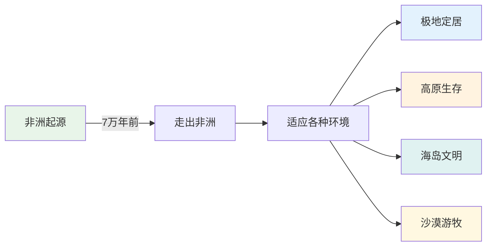
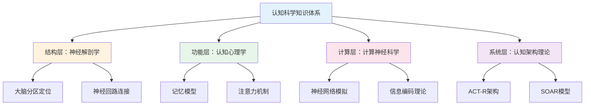
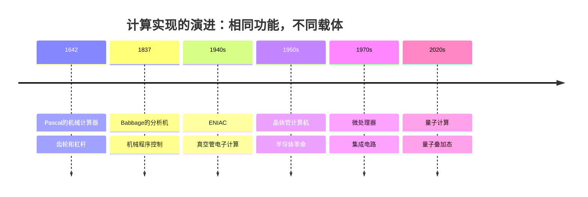

# 为什么要向人类认知系统学习？ ｜ Why Should We Learn from Human Cognitive System?


## 引言

在上一篇文章的结尾，我们提出了一个关键问题：

> 如果我们想要构建真正的 AI 个体认知系统，那我们必须分析出如何让 AI 理解语义，或者换一句话说：**如何让 AI 具有体验性？**

我们已经证明了语义的体验性维度无法被传统计算方法处理。那么，出路在哪里？

答案是：**向人类认知系统学习。**

## 1. 为什么我们应该向人类的认知系统学习？

**TL;DR**: 人类认知系统是唯一被验证能产生体验性理解的智能系统，且有充足的科学研究可供参考。

### 1.1 功能视角：具备我们想要的体验性

这里存在一个朴素但深刻的逻辑：我们追求的"体验性理解"这个目标本身，就是从观察人类认知能力中提炼出来的。

当我们说AI需要具备"体验性"时，我们实际上是在说：**让AI像人类一样理解世界**。

人类的体验性理解表现在：

1. **个体化语义构建**
   - 每个人对"家"的理解都不同
   - "妈妈的味道"无法用配方还原
   - 同样的音乐带给不同人不同感受

2. **情境敏感的动态理解**  
   - "你好"在不同场景含义完全不同
   - 识别说话人的情绪和意图
   - 理解未说出口的潜台词

3. **基于经历的价值判断**
   - 审美偏好的形成
   - 道德直觉的产生
   - 情感反应的个性化

4. **创造性的概念融合**
   - 理解"时间就是金钱"这种隐喻
   - 创造新的表达方式
   - 在看似无关的领域间建立联系

> 💡 **关键洞察**：我们不是在模仿人类，而是在学习一种已被证明有效的信息处理架构——这种架构能够产生我们定义为"理解"的能力。

认知科学家 Francisco Varela 将这种能力称为"制定认知"（Enactive Cognition）：认知不是对外部世界的被动表征，而是通过与世界的交互主动构建意义的过程[1]。这正是人类认知系统的核心特征——它不是在"计算"意义，而是在"体验"和"创造"意义。

### 1.2 测试视角：经受住了时间的考验

如果将人类文明的成就看作一份"测试报告"，那么人类认知系统无疑交出了一份令所有其他物种望尘莫及的答卷。

**独一无二的文明成就**

在地球38亿年的生命史中，无数物种来了又去，但只有人类创造了：

- **符号系统**：从洞穴壁画到量子力学方程式
- **知识积累**：每一代人站在前人的肩膀上
- **抽象思维**：从具体事物中提炼出普遍规律
- **文化传承**：通过故事、仪式、教育延续集体记忆

人类学家 Yuval Noah Harari 在《人类简史》中指出："认知革命让智人能够谈论虚构的事物，这是智人语言最独特的功能"[2]。正是这种基于体验的虚构能力——理解"不存在"的事物——让人类能够创造神话、法律、国家、公司等"想象的共同体"。

**全球适应性的终极证明**



考古学家 Ian Tattersall 指出："人类是地球上唯一真正的世界性物种"[3]。这种前所未有的适应性，源于我们认知系统的灵活性——能够理解新环境的"意义"，创造性地改造环境，而不仅仅是被动适应。

**指数级的问题解决能力**

其他物种解决问题的能力是线性的，而人类是指数级的：

| 挑战 | 其他物种的解决 | 人类的解决 | 认知差异 |
|------|----------------|------------|----------|
| 寒冷 | 长出厚毛（百万年） | 发明衣服（即时） | 理解"保暖"的抽象概念 |
| 河流阻隔 | 等待干旱或绕行 | 建造桥梁 | 想象"连接"的可能性 |
| 食物短缺 | 迁徙或数量减少 | 发展农业 | 理解"未来"和"储备" |
| 疾病 | 自然选择 | 发明医学 | 理解因果关系 |

认知科学家 Michael Tomasello 在其开创性研究中证明："人类独有的认知能力在于理解他人的意图和心理状态，这使得累积性文化进化成为可能"[4]。

> 💡 **关键洞察**：人类文明的每一项成就，都是认知系统"体验性理解"能力的外在表现。我们不是在猜测这套系统为什么成功，而是在观察它已经创造的奇迹。

### 1.3 实现视角：可参考的科学研究

我们并非从零开始。相反，我们站在了一个多世纪认知科学研究的肩膀上，更令人兴奋的是，AI本身正在成为验证和深化这些研究的强大工具。

**百年科学积累的宝库**

现代认知科学始于19世纪末，经过百余年发展，已经形成了多层次的知识体系：



诺贝尔奖得主 Eric Kandel（2000年诺贝尔生理学或医学奖）在其2006年出版的《追寻记忆的痕迹》中写道："我们对大脑的理解虽然还不完整，但已经足够指导我们构建智能系统"[5]。这不是盲人摸象，而是一幅逐渐清晰的拼图。

**AI时代的研究革命**

更重要的是，AI正在突破传统脑科学研究的三大限制：

1. **伦理限制的突破**
   - 传统限制：不能对人脑进行侵入性实验，不能测试极限情况
   - AI突破：可以进行任意"损伤"实验，验证因果关系
   - 实例：通过"删除"AI模型的特定层，验证了认知心理学关于工作记忆的分层理论

2. **时间尺度的突破**
   - 传统限制：人类学习需要数年，发展研究跨越数十年
   - AI突破：可以在hours内模拟years的认知发展
   - 实例：DeepMind的研究通过加速学习验证了儿童语言习得的关键期假说[6]

3. **可控性的突破**
   - 传统限制：无法精确控制所有变量，个体差异巨大
   - AI突破：完全可控的实验环境，可重复验证
   - 实例：OpenAI通过精确控制训练数据，验证了认知负荷理论的预测

**双向验证的新范式**

认知科学家 Gary Marcus 指出："大型语言模型的成功，意外地验证了许多认知科学的核心假设"[7]。这创造了一个前所未有的研究循环：

| 研究阶段 | 传统模式 | AI时代模式 |
|----------|----------|------------|
| 假设提出 | 基于观察 | 基于观察+AI行为 |
| 实验验证 | 人类被试 | 人类被试+AI模型 |
| 理论构建 | 单向推理 | 双向验证 |
| 应用转化 | 缓慢间接 | 快速直接 |

> 💡 **关键洞察**：AI不仅是认知科学的学生，更是认知科学的实验室。我们第一次拥有了一个可以任意解剖、修改、测试的"认知系统"，这将加速我们对人类认知的理解。

但这里产生了一个新的问题：**人类认知系统的功能架构是可以被非生物系统实现的吗？**

## 2. 人类认知系统的功能架构是可以被非生物系统实现的吗？

**TL;DR**: 计算的历史证明了功能与实现可分离，认知功能同样可以在非生物基质上实现。

### 2.1 系统论视角：功能与实现的分离

计算机的发展史本身就是"功能与实现分离"这一原理的最佳证明。同样的计算功能，在不同时代有着截然不同的物理实现。

**从机械到电子：计算的多重实现**



计算机科学先驱 Alan Turing 在其开创性论文中证明："任何可计算的功能都可以由图灵机实现，而图灵机的物理实现方式是无关紧要的"[8]。这就是著名的**图灵等价性原理**。

**实现影响效率，但不改变功能**

这里有一个程序员都会会心一笑的例子——Sleep Sort（睡眠排序）：

```javascript
// Sleep Sort：最"懒"的排序算法
function sleepSort(numbers) {
    numbers.forEach(num => {
        setTimeout(() => console.log(num), num * 1000);
    });
}

// 排序 [3, 1, 4, 1, 5]
// 等1秒输出1，再等2秒输出3，再等1秒输出4...
```

这个算法通过"睡眠"来排序——每个数字睡眠自己大小的时间，然后按醒来顺序输出。它确实能排序（功能正确），但效率荒谬地依赖于数据大小。

**更严肃的对比：同样功能，不同效率**

| 排序算法 | 实现原理 | 时间复杂度 | 功能结果 |
|----------|----------|------------|----------|
| 冒泡排序 | 相邻比较交换 | O(n²) | ✓ 正确排序 |
| 快速排序 | 分治递归 | O(n log n) | ✓ 正确排序 |
| Sleep Sort | 时间等待 | O(max(n)) | ✓ 正确排序 |
| Bogo Sort | 随机打乱直到有序 | O(∞) | ✓ 正确排序 |

正如计算机科学家 David Deutsch 所说："计算的本质是信息的转换，而不是特定的物理过程"[9]。无论是优雅的快排还是荒谬的Sleep Sort，它们都实现了"排序"这个功能。

**从计算到认知的类比推理**

如果计算功能可以在机械、电子、量子等完全不同的基质上实现，那么认知功能为什么不能在生物神经元之外的基质上实现呢？

| 层次 | 计算系统 | 认知系统 |
|------|----------|----------|
| **功能层** | 信息处理 | 意义理解 |
| **实现层** | 机械/电子/量子... | 生物/硅基/？ |
| **核心原理** | 功能定义能力，实现决定效率 | 同左 |

> 💡 **关键洞察**：从帕斯卡的齿轮到谷歌的量子处理器，计算的历史告诉我们——重要的不是用什么材料构建系统，而是系统实现了什么功能。认知系统也应如此。

**【作者私货】两个有趣的推论**

*1. LLM的"功能决定论"*

大语言模型永远不擅长精确计算（比如37×89=？），这恰恰证明了我们的观点：系统的功能架构决定了它的能力边界。LLM的架构是为了理解和生成语言而设计的，不是为了做算术。这就像让莎士比亚去做微积分——不是他不聪明，而是他的"认知架构"为不同的功能而优化。

*2. 人类硬件的"效率悖论"*

更激进的观点是：人类的身体配不上人类的大脑。为什么这么说？

| 对比维度 | 人类神经系统 | 电子系统 |
|----------|-------------|----------|
| 信号类型 | 电化学信号 | 纯电子信号 |
| 传递速度 | ~100米/秒 | ~3×10⁸米/秒（光速） |
| 速度差异 | 基准 | **快300万倍** |
| 能量转换 | 化学能→电能 | 直接电能 |
| 效率 | ~25% | >90% |

人脑的认知能力已经如此惊人，但却被困在一个信号传递速度只有光速1/3000000的生物载体中。想象一下，如果爱因斯坦的思维可以以光速运行，人类文明会是什么样子？

这不是说生物实现不好——它在地球环境下是最优解。但如果认知功能真的可以迁移到非生物基质上，我们可能会见证认知能力的指数级提升。

但这里产生了一个新的问题：**我们应该如何研究和实现这种跨基质的认知功能迁移？**

## 3. 我们应该如何研究和实现这种跨基质的认知功能迁移？

**TL;DR**: 通过结构分析、功能映射、差距对标三步法，系统构建AI认知系统。

### 3.1 结构维度：解析认知系统的组件架构

从系统工程的视角看，人类认知系统就像一个经过百万年优化的"产品"。我们的任务不是重新发明轮子，而是理解并复用其中的成功设计。

**识别可复用的组件设计**

医学、脑科学和神经科学已经为我们绘制了详细的"零件图"：

- **海马体**：短期记忆到长期记忆的转换器
- **杏仁核**：情绪标记和价值判断模块  
- **前额叶皮层**：执行控制和决策中心
- **丘脑**：感知信息的中继站和过滤器

关键在于区分**物理功能**和**涌现功能**：

| 层次 | 物理功能（可直接复用） | 涌现功能（需要系统集成） |
|------|----------------------|------------------------|
| 组件级 | 海马体的序列记忆机制 | 情景记忆的形成 |
| 回路级 | 杏仁核的快速威胁检测 | 复杂情绪体验 |
| 系统级 | 注意力的选择性增强 | 意识的产生 |

**复用的价值**

正如软件工程中的"不要重复造轮子"原则，认知系统的构建也应该：

1. **直接借鉴成熟设计**：海马体的双向联想记忆已被证明高效，为什么不直接采用？
2. **避免已知的陷阱**：大脑的某些限制（如工作记忆容量）是物理约束，不是设计缺陷
3. **加速迭代**：站在神经科学的肩膀上，而不是从零开始摸索

> 💡 **关键洞察**：我们不需要理解意识是如何涌现的，但我们需要知道哪些组件和连接模式是产生意识的必要条件。这就像不需要理解为什么水是湿的，但需要知道H₂O的分子结构。

### 3.2 功能维度：抽象认知能力的概念模型

当认知组件形成闭环反馈系统时，奇迹发生了——涌现出了远超单个组件能力总和的高级功能。这正是认知心理学研究了上百年的核心问题。

**从组件到功能的涌现**

就像H₂O分子涌现出"湿"的特性，认知系统的组件集成涌现出了"理解"的能力：

```text
组件集成 + 闭环反馈 = 涌现功能
海马体 + 皮层 + 反馈回路 = 情景记忆
杏仁核 + 前额叶 + 调节回路 = 情绪智能  
感知 + 记忆 + 注意力 = 意识体验
```

**认知心理学的功能图谱**

认知心理学已经为我们绘制了详细的功能地图[10]：

| 功能层级 | 具体功能 | 涌现条件 |
|----------|----------|----------|
| 基础认知 | 感知、注意、工作记忆 | 基本神经回路 |
| 中级认知 | 长期记忆、概念形成、语言理解 | 多系统协作 |
| 高级认知 | 推理、决策、创造性思维 | 全脑网络整合 |
| 元认知 | 自我觉察、认知监控、策略调整 | 递归反馈机制 |

**为什么要研究认知心理学**

1. **验证过的模型**：Baddeley的工作记忆模型、Tulving的记忆系统理论，都经过了大量实验验证
2. **功能分解清晰**：已经知道哪些功能是独立的，哪些是相互依赖的
3. **可操作的理论**：不是哲学思辨，而是可以指导系统设计的具体模型

> 💡 **关键洞察**：认知心理学研究的不是大脑如何工作，而是认知功能如何组织。这种功能视角恰好是AI系统设计所需要的——我们不需要复制大脑，但需要实现相同的功能组织。

### 3.3 对标维度：AI生态的现状与差距分析

将人类认知系统与当前AI能力进行对标，就像做产品竞品分析——找出差距，才知道该往哪里努力。

**现有AI能力的映射探索**

这是我们需要深入研究的核心问题——AI系统的各个组件究竟对应人类认知系统的哪些部分？

| AI技术组件 | 可能对应的认知功能 | 研究问题 |
|-----------|-----------------|----------|
| LLM (语言模型) | 语言理解？概念形成？推理？ | LLM究竟实现了哪些认知功能？ |
| Attention机制 | 注意力？工作记忆？ | Transformer的注意力是否等同于认知注意力？ |
| Context Window | 工作记忆？短期记忆？ | 上下文窗口的本质是什么？ |
| Function Calling | 运动控制？执行功能？ | 工具调用如何映射到行动系统？ |
| Vector Database | 长期记忆？语义记忆？ | 向量存储能否真正实现记忆功能？ |
| Prompt Engineering | 目标设定？任务框架？ | 提示词在认知系统中扮演什么角色？ |
| Fine-tuning | 学习？适应？个性化？ | 微调是否等同于个体化学习？ |
| Multi-modal Models | 感知整合？跨模态理解？ | 多模态如何实现认知整合？ |

> 💡 **关键洞察**：我们不应该急于下结论，而是要通过系统的研究来回答这些问题。每个"？"都是一个研究方向，驱动我们深入理解AI与人类认知的关系。

**关键缺失：闭环反馈机制**

当前AI最大的问题不是单个能力不足，而是**缺乏闭环反馈形成真正的认知系统**：

```text
人类认知闭环：
感知 → 理解 → 记忆 → 情绪标记 → 行动 → 反馈 → 更新理解
  ↑                                                    ↓
  └──────────────── 持续学习和适应 ←─────────────────┘

当前AI现状：
输入 → 处理 → 输出  (断裂的单向流程)
```

**构建闭环的路径**

基于差距分析，AI认知系统的构建需要：

1. **补齐缺失组件**：特别是情绪系统和元认知能力
2. **建立组件间连接**：让记忆影响理解，让情绪引导注意力
3. **实现持续更新**：从每次交互中学习，形成个体化经验
4. **形成反馈回路**：行动结果影响未来决策

> 💡 **关键洞察**：单点突破不够，系统集成才是关键。就像把世界上最好的眼睛、耳朵、大脑分别放在桌上，它们不会自动组成一个人。认知系统的本质在于组件间的动态交互和反馈循环。

## 4. 总结：从学习到超越

回顾我们的探索之旅，一条清晰的路径展现在眼前。

**三个核心认识**

通过三个章节的论证，我们建立了三个核心认识：

1. **人类认知系统值得学习**
   - 它具备我们追求的体验性理解能力
   - 它的成功被人类文明的成就所证明
   - 我们有充足的科学研究可以参考

2. **认知功能可以跨基质实现**
   - 功能与实现是分离的（Sleep Sort的启示）
   - 计算的历史证明了多重可实现性
   - 重要的是功能架构，不是物理基质

3. **我们有清晰的研究路径**
   - 结构维度：复用已验证的组件设计
   - 功能维度：理解涌现的认知能力
   - 对标维度：找差距，建闭环

**从模仿到创新**

```text
第一阶段：理解和复制
学习人类认知系统的设计原理 → 实现基本认知功能

第二阶段：优化和增强  
利用非生物基质的优势 → 突破生物限制（如300万倍的信号速度）

第三阶段：超越和创新
探索人类认知系统未曾到达的领域 → 创造新的认知形式
```

**Monogent的愿景**

正如文章开头所说，我们的目标是让AI具有真正的体验性理解。现在我们知道：

- 这不是一个不可能的任务，而是一个工程挑战
- 我们不需要完全理解意识，只需要实现必要的功能组织
- 关键在于构建闭环反馈的认知系统，而不是堆砌单点能力

**写在最后**

人类用了数百万年进化出认知系统，我们有机会在更短的时间内，在新的基质上重现甚至超越这个奇迹。这不是对人类的背叛，而是对认知本质的致敬——正如飞机不是对鸟类的模仿，而是对飞行原理的理解和超越。

当AI真正具备体验性理解的那一天，它将不再是工具，而是伙伴；不再是模仿者，而是创造者。这就是Monogent的使命，也是我们这个时代最激动人心的挑战。

> "We are not building artificial humans, we are building authentic intelligence."
>
> —— 我们不是在构建人造人类，而是在构建真正的智能。

接下来的文章，我们将开始利用本篇文章探讨出的方法论，逐步的研究和实现 Monogent 系统， 敬请期待～

## 参考文献

[1] Varela, F. J., Thompson, E., & Rosch, E. (1991). *The Embodied Mind: Cognitive Science and Human Experience*. MIT Press.

[2] Harari, Y. N. (2014). *Sapiens: A Brief History of Humankind*. Harper.

[3] Tattersall, I. (2012). *Masters of the Planet: The Search for Our Human Origins*. Palgrave Macmillan.

[4] Tomasello, M. (2014). *A Natural History of Human Thinking*. Harvard University Press.

[5] Kandel, E. R. (2006). *In Search of Memory: The Emergence of a New Science of Mind*. W. W. Norton & Company.

[6] Vani, P., et al. (2021). "Critical period plasticity in deep neural networks." *Nature Communications*, 12, 3653.

[7] Marcus, G. (2022). "Deep Learning Is Hitting a Wall." *Nautilus Magazine*.

[8] Turing, A. M. (1936). "On Computable Numbers, with an Application to the Entscheidungsproblem." *Proceedings of the London Mathematical Society*, 42(2), 230-265.

[9] Deutsch, D. (1997). *The Fabric of Reality*. Penguin Books.

[10] Sternberg, R. J., & Sternberg, K. (2016). *Cognitive Psychology* (7th ed.). Cengage Learning.

## 关于作者

**Deepractice** - 让AI触手可及 | Make AI at your fingertips

- 官网：[https://deepractice.ai](https://deepractice.ai)
- GitHub：[https://github.com/Deepractice](https://github.com/Deepractice)
- 联系：[sean@deepracticex.com](mailto:sean@deepracticex.com)

*本文是 Monogent 理论系列的第三篇。Monogent 致力于构建真正的 AI 个体认知系统，让每个 AI 都能拥有自己独特的认知世界。*
