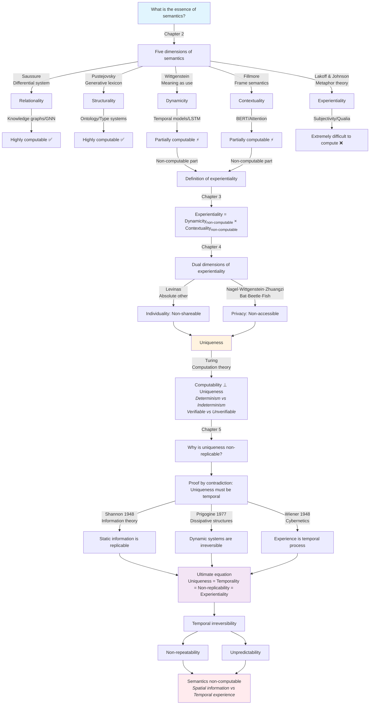

# Why Can't Semantics Be Computed?

## 1. The Fundamental Question: What Is Semantics?

> **TL;DR**
> 
> RAG's fundamental flaw lies in semantic degradation, which constitutes the essence of memory and comprehension.

In our previous analysis ["Why RAG Isn't All You Need for AI Memory"](https://deepractice.ai/blog/rag-not-all), we identified RAG's core deficiencies:

- **Semantic Loss**: RAG compresses rich semantic content through vectorization, transforming "I enjoy eating strawberries" into "I enjoy consuming grass"
- **Fragmented Retrieval**: Decomposing coherent cognitive units into fragments, thereby destroying semantic integrity
- **Symbol-Meaning Disjunction**: Computation manipulates symbols but cannot access authentic meaning

We illustrated this fundamental gap:

| RAG's Domain (Symbolic Layer) | Authentic Memory (Semantic Layer) |
|-------------------------------|------------------------------------|
| Vector Similarity | Semantic Associations |
| Fragment Matching | Holistic Comprehension |
| Statistical Patterns | Cognitive Modalities |
| Information Retrieval | Experience Reconstruction |

This analysis reveals a profound question: **If semantics constitutes the essence of memory and RAG fails to preserve it, what precisely is semantics? More fundamentally, can semantics be computed?**

This inquiry transcends RAG's limitations, addressing whether artificial intelligence can achieve genuine understanding and cognition.

To address this question rigorously, we must undertake a systematic philosophical and computational investigation. We will examine semantics across five dimensions, analyze their computational tractability, and ultimately demonstrate why semantics—particularly its experiential dimension—remains fundamentally non-computable.

## 2. The Five Dimensions of Semantics

> **TL;DR**
> 
> Semantics is not an intrinsic property of symbols but rather a complex constellation of relational, dynamic, contextual, experiential, and structural dimensions.

To comprehend why semantics resists computational treatment, we must first establish its fundamental nature. Through decades of interdisciplinary research spanning linguistics, cognitive science, and philosophy of mind, we can identify five essential dimensions that constitute semantic phenomena:

1. **Relationality** - Meaning emerges through differential systems and interconnections
2. **Dynamicity** - Meaning evolves through usage and temporal development
3. **Contextuality** - Meaning depends upon situational and cultural frameworks
4. **Experientiality** - Meaning is grounded in subjective, first-person experience
5. **Structurality** - Meaning exhibits organized, hierarchical properties

Let us examine each dimension systematically:

### Relationality

Saussure's foundational insight established that language constitutes a system of differences, where meaning emerges from contrasts and relational networks rather than inherent properties [1]. No linguistic unit exists in isolation:

- "Large" derives meaning through opposition to "small"
- "Father" requires the relational concept "child"
- "Red" emerges through distinction from other chromatic categories

Firth's distributional hypothesis—"You shall know a word by the company it keeps" [2]—provides the theoretical foundation for contemporary distributed semantic models.

### Dynamicity

Wittgenstein's revolutionary proposition in *Philosophical Investigations*—"meaning is use" [3]—demonstrates that semantics is not static but evolves through contextual deployment:

- Lexical items undergo semantic change across temporal dimensions
- Identical expressions manifest different meanings across contexts
- Novel usage patterns generate emergent semantic content

His "language games" framework reveals that understanding a word resembles mastering game rules, requiring active participation in usage scenarios.

### Contextuality

Fillmore's frame semantics demonstrates that word comprehension activates comprehensive cognitive frameworks [4]:

- "Purchase" activates the commercial frame (buyer, seller, commodity, price)
- "Tuesday" presupposes the weekly temporal system
- "Shore" necessitates the land-water relational framework

Without these contextual frames, lexical items become semantically vacuous.

### Experientiality

Lakoff and Johnson's embodied cognition thesis in *Metaphors We Live By* argues that human conceptualization is fundamentally metaphorical, with abstract concepts understood through concrete experiential mappings [5]:

- "Life is a journey" (spatial domain → temporal domain)
- "Argument is war" (physical conflict → verbal discourse)
- "Theory is building" (architectural structure → abstract framework)

This embodied conceptualization constitutes semantics' fundamental mechanism.

### Structurality

Pustejovsky's Generative Lexicon Theory proposes four semantic strata [6]:

1. **Argument Structure**: Participant role specifications
2. **Event Structure**: Temporal process typologies
3. **Qualia Structure**: Constitutive, formal, telic, and agentive properties
4. **Inheritance Structure**: Type-hierarchical organizations

This systematic framework enables comprehension of complex compositional meanings and novel lexical deployments.

### Theoretical Synthesis

These five dimensions constitute semantics' essential architecture. As Gärdenfors' conceptual spaces theory demonstrates, concepts are regions within multi-dimensional cognitive space, with meaning as geometric structures therein [7].

This analysis leads to our central question: **Which of these dimensions admit computational treatment, and which remain fundamentally intractable?**

## 3. The Computability Spectrum: Which Semantic Features Can Be Computed?

> **TL;DR**
> 
> Relational and structural dimensions are highly computable, dynamic and contextual are partially computable, but experiential is fundamentally non-computable.

Now that we understand the five dimensions of semantics, we can analyze their computability. This analysis will reveal why current AI systems struggle with true semantic understanding and why RAG fails as a memory system.

Let's examine each dimension through the lens of computational theory:

### Relational - Highly Computable ✅

Graph theory provides solid foundations [8]:

**Implementations:**
- **Knowledge Graphs**: Neo4j, RDF triples
- **Graph Neural Networks** (GNN): Learn relation patterns [9]
- **Word2Vec**: Learns from co-occurrences [10]

**Limitations:** Implicit relations need inference.

### Structural - Highly Computable ✅

Formal grammars and type theory [11]:

**Implementations:**
- **Ontologies**: OWL, Protégé
- **Type Systems**: In programming
- **Syntactic Parsing**: Dependency/constituent

**Case:** WordNet with 117,000 synsets [12].

### Dynamic - Partially Computable ⚡

**Computable:** Online learning, LSTMs, Transformers [13,14].

**Not:** Meaning mutations, cultural evolutions.

### Contextual - Partially Computable ⚡

**Computable:** BERT, Attention [15,16].

**Not:** Cultural backgrounds, implicit knowledge.

### Experiential - Hardly Computable ❌

**Definition:** Experiential = Dynamic non-computable × Contextual non-computable.

Examples like "Hamlet" interpretations show uniqueness.

#### Computability Summary

| Feature | Computability | Key Tech | Obstacles |
|---------|---------------|----------|-----------||
| Relational | ⭐⭐⭐⭐⭐ | Graphs | Implicit discovery |
| Structural | ⭐⭐⭐⭐⭐ | Ontologies | Auto-discovery |
| Dynamic | ⭐⭐⭐ | Temporal models | Innovations |
| Contextual | ⭐⭐⭐ | Attention | Cultural implicit |
| Experiential | ⭐ | Multimodal | Subjectivity |
## 4. The Heart of Non-Computability: Understanding Experientiality

> **TL;DR**
> 
> Experientiality is the individual and private dimension of semantics, leading to its fundamental uniqueness and non-computability.

We have established that experientiality is the least computable dimension of semantics. But what exactly is experientiality, and why does it pose such a fundamental challenge to computation?

**Experientiality** refers to the aspect of meaning that is rooted in personal, subjective experience—the "what it's like" quality of understanding. It represents the intersection of the non-computable aspects of dynamics and context, creating something entirely new: **subjective meaning**.

### Mathematical Definition of Experientiality

We can formally define experientiality as:

```
Experientiality = Dynamic_non-computable × Contextual_non-computable
```

Where:
- **Dynamic_non-computable**: The aspects of meaning change that cannot be predicted or modeled
- **Contextual_non-computable**: The implicit, cultural, and personal contexts that cannot be formalized

This intersection creates something qualitatively different from its components—a emergent property that transcends computational modeling.

### The Two Fundamental Dimensions of Experientiality

Experientiality manifests through two irreducible dimensions:

#### 1. Individuality - Non-Shareable

Individuality means that each person's understanding is fundamentally unique and cannot be shared or transferred to another consciousness.

**Philosophical Foundation**: Emmanuel Levinas's concept of the "absolute Other" [20]

Levinas argues that the Other (autrui) is fundamentally unknowable and irreducible to our own experience. He writes:

> "The face of the other calls us to responsibility that is non-transferable and not to be shared."

This philosophical insight has profound implications for semantics:

**Example: The Concept of "Success"**
- My understanding of "success" is based on my values and life trajectory
- Your understanding of "success" is based on your unique experiences
- Even when we both say "success," we may be pointing to entirely different semantic spaces

As the Chinese proverb states, "一千个读者，一千个哈姆雷特" (yī qiān gè dú zhě, yī qiān gè hā mǔ léi tè - A thousand readers have a thousand Hamlets)—each person constructs a unique understanding based on their individual life experiences.

#### 2. Privacy - Non-Accessible

Privacy encompasses two levels: experiences cannot be observed, nor can they be fully communicated.

**The Unobservable Dimension**: Thomas Nagel's "What Is It Like to Be a Bat?" [21]

Nagel's famous thought experiment illustrates the fundamental privacy of conscious experience:

> "Even if I could gradually be transformed into a bat, nothing in my present constitution enables me to imagine what the experiences of such a future stage of myself thus metamorphosed would be like."

This echoes the ancient Chinese philosopher Zhuangzi's (庄子) "Debate at Hao Bridge" (濠梁之辩):

> Huizi said: "You are not a fish—how do you know the happiness of fish?"
> Zhuangzi replied: "You are not me—how do you know that I don't know the happiness of fish?"

**The Ineffable Dimension**: Wittgenstein's "Beetle in a Box" Thought Experiment [22]

Wittgenstein illustrates the privacy of inner experience:

> "Suppose everyone had a box with something in it: we call it a 'beetle'. No one can look into anyone else's box, and everyone says he knows what a beetle is only by looking at his beetle."

This dual privacy means:
- Experiences cannot be externally observed (neuroscience can see brain activity, but not "understanding")
- Experiences cannot be fully communicated through language (the word "pain" cannot convey the feeling of pain)
- We are forever locked in our own first-person perspective

### The Convergence: Uniqueness

These two dimensions converge on a single, ultimate characteristic: **Uniqueness**

**Individual → Unique**: Because each person is a unique individual
**Private → Unique**: Because what cannot be accessed cannot be replicated

### Why Uniqueness Is Critical

Uniqueness means:
- **Non-Repeatable**: Cannot be verified through repeated experiments
- **Non-Comparable**: Cannot establish objective comparison standards
- **Non-Generalizable**: Cannot derive universal laws from individual cases

**This directly contradicts Turing's computational theory.**

### The Core Characteristics of Turing Computation

According to Turing's computational theory, a computable system must satisfy [17]:

1. **Determinism**: "Given the same input and initial state, it always produces the same output." This is the fundamental property of Turing machines—each execution must yield identical results.

2. **Verifiability**: Computation must be executable in a "reliable, repeatable, and verifiable manner." This is the basic assumption of the Church-Turing thesis.

3. **Finiteness**:
   - Finite instruction set
   - Finite number of states
   - Finite steps to produce results

### The Three Pillars of Computation

Turing's theory reveals that computation depends on three foundational pillars:

**1. Repeatability → Deterministic Computation**
```
Same Input + Same Program = Same Output
```
As computational theory states: "If you start with the same input, perform the same operations, you will get the same output." This repeatability enables algorithms to be verified, debugged, and relied upon.

**2. Comparability → Equivalence Decision**
```
Computation Result A = Computation Result B? (Decidable)
Experience A = Experience B? (Undecidable)
```
Turing machines can compare whether two computational results are identical, but cannot compare whether two subjective experiences are the same.

**3. Universal Laws → Algorithmic Abstraction**
```
Specific Cases → General Patterns → Universal Algorithms
```
The Church-Turing thesis states: "Any function that can be computed algorithmically can be computed by a Turing machine." This relies on the ability to generalize from particular to universal.

### The Fundamental Conflict Between Uniqueness and Computation

Experiential uniqueness directly violates all premises of Turing computation:

| Turing Computation Requirements | Unique Experience Characteristics |
|--------------------------------|----------------------------------|
| Determinism: Same input → Same output | Indeterminacy: Same text → Different understanding |
| Single computation path | Infinite possible paths |
| Reproducible states | Irreproducible states |
| Verifiable results | Unverifiable experiences |

This is why Wittgenstein said: "Inner processes require external criteria" [3]—because without external criteria, Turing-style computation becomes impossible.

Therefore, **the experiential nature of semantics, i.e., uniqueness, makes it fundamentally incompatible with Turing computability requirements**. This is not a technical limitation, but a logical impossibility.

**At this point, we have proven that semantics cannot be computed.**

But we can dig deeper: **What is the essence of uniqueness? Why is uniqueness non-replicable?**

## 5. Why Is Uniqueness Non-Replicable?

> **TL;DR**
> 
> True uniqueness is necessarily temporal, and time is irreversible.

To understand why uniqueness is non-replicable, we need to prove a core proposition: **The essence of uniqueness is temporality**.

### Proof by Contradiction: Uniqueness Must Be Temporal

Let's start with a simple dichotomy: any existence can be classified into two types:
- **Spatial existence**: Existence that can be described by static structures
- **Temporal existence**: Existence that must be described by dynamic processes

**Step 1: Assume uniqueness is not temporal**

If uniqueness doesn't involve time, then it must be spatial—a property that can be completely described by static structures.

**Step 2: Static structures are necessarily replicable**

### Shannon's Information Replication Principle

Claude Shannon, in establishing information theory in 1948, articulated a fundamental principle [23]:

> "Any finite discrete information can be completely replicated and transmitted without information loss."

**Illustrative examples**:
- Textual content can be perfectly duplicated
- Digital imagery can be precisely reproduced
- Genetic sequences can be accurately replicated

This principle establishes that: **Any static structure representable as information is inherently replicable.**

**Step 3: Contradiction arises**

- Premise: Uniqueness means non-replicable
- Inference: If uniqueness is static, then it's replicable (according to Shannon's theorem)
- Contradiction: Uniqueness is both non-replicable and replicable

**Conclusion: Uniqueness cannot be static; it must be dynamic and temporal.**

### Positive Argument: How Time Creates Uniqueness

Since uniqueness must be temporal, how does time create uniqueness?

### Prigogine's Dissipative Structure Theory

Nobel Prize winner Ilya Prigogine, in studying systems far from equilibrium, discovered a profound truth [24]:

> "Time is the source of creation. Under conditions far from equilibrium, matter acquires new properties: it becomes sensitive, coherent, 'alive'."

Dissipative structures are characterized by:
1. **Open systems**: Exchange matter and energy with environment
2. **Non-equilibrium states**: Far from thermodynamic equilibrium
3. **Temporal irreversibility**: Evolution has a clear direction

**Biological systems exemplify dissipative structures**:
- Trees continuously exchange matter with their environment (water, CO2, nutrients)
- They maintain states far from thermodynamic equilibrium (living vs. deceased)
- They undergo irreversible temporal evolution at every moment

This elucidates why "no two leaves are identical"—each leaf constitutes a unique dissipative structure with its own irreproducible temporal trajectory. Even if two leaves possessed identical spatial configurations (hypothetically possible), their temporal histories would necessarily diverge.

### From Spatial Uniqueness to Temporal Uniqueness

Let's distinguish two types of uniqueness:

**Spatial Uniqueness (Pseudo-uniqueness)**:
- The Eiffel Tower occupies a unique spatial position
- However, this uniqueness is reproducible (an identical structure could be constructed)
- Spatial positional uniqueness does not constitute genuine uniqueness

**Temporal Uniqueness (Authentic uniqueness)**:
- Each leaf's developmental trajectory is unique
- This uniqueness is irreproducible (temporal histories cannot be recreated)
- Temporal processual uniqueness represents authentic uniqueness

### Experience: Pure Temporal Existence

If a leaf's growth still involves changes in spatial structure, then experience is a purer form of temporal existence.

**Example from "Dream of the Red Chamber" (红楼梦)**:
- Reading at 15: Seeing the love story of Baoyu and Daiyu
- Reading at 30: Understanding the rise and fall of family fortunes
- Reading at 50: Experiencing life as dream-like and illusory

Identical text, different temporal contexts, entirely distinct experiential outcomes. This variance does not result from textual modification (spatial structure remains constant), but from your temporal transformation.

### The Ultimate Equation: Four Names for One Truth

Through this analysis, we discover a profound equation:

```
Uniqueness = Non-replicability = Temporality = Experientiality
```

These constitute not four distinct concepts, but four designations for a singular truth:

1. **Uniqueness**: Philosophical perspective - existential distinctiveness
2. **Non-replicability**: Information-theoretic perspective - the limits of Shannon's framework
3. **Temporality**: Physical perspective - Prigogine's irreversible dynamics
4. **Experientiality**: Phenomenological perspective - first-person subjective consciousness

### Back to Semantics: Why Semantics Cannot Be Computed

Now we can completely answer the original question:

**Semantics cannot be computed because:**
1. The core of semantics is experientiality (proven in Chapters 2-4)
2. Experientiality implies uniqueness (proven in Chapter 4)
3. The essence of uniqueness is temporality (proven in this chapter)
4. Temporality is fundamentally opposed to computability (proven by Turing theory)

Therefore, semantic non-computability represents not a technical limitation, but a logical necessity:
- Computation processes **spatial information** (storable, replicable, transmittable)
- Semantics depends on **temporal experience** (non-storable, non-replicable, non-transmittable)

This resembles attempting to capture musical essence through photography, or substituting cartographic representation for experiential travel—the dimensional incongruence renders complete conversion logically impossible.

## 6. Conclusion: The Logical Necessity of Semantic Non-Computability

> **TL;DR**
> 
> Semantics cannot be computed because its experiential nature is fundamentally temporal and unique, which logically contradicts the spatial, replicable nature of computation.

We have completed a rigorous logical proof through five chapters. Let us visualize the entire reasoning path and theoretical support with a diagram:



### The Complete Logical Chain

Through our analysis, we have established a complete logical chain proving why semantics cannot be computed:

1. **Semantics has five dimensions**: Relationality, Dynamicity, Contextuality, Experientiality, and Structurality
2. **Four dimensions are partially computable**: Relationality, Dynamicity, Contextuality, and Structurality can be approximated through algorithms
3. **One dimension is fundamentally non-computable**: Experientiality cannot be computed due to its unique nature
4. **Experientiality is the core of semantics**: Without subjective experience, there is no true semantic understanding
5. **Uniqueness conflicts with Turing computation**: The deterministic, repeatable nature of computation cannot handle unique, non-replicable experiences
6. **The essence of uniqueness is temporality**: True uniqueness arises from irreversible temporal processes
7. **Computation is spatial, semantics is temporal**: This dimensional difference makes complete semantic computation logically impossible

### Implications for AI Development

This analysis has profound implications for AI development:

**1. RAG's Fundamental Limitation**
RAG (Retrieval-Augmented Generation) fails as an AI memory system because it misconceptualizes semantics as computable information. While it can retrieve and process spatial knowledge representations, it cannot capture the temporal, experiential dimension of understanding.

**2. The Boundaries of AI Capability**
AI systems demonstrate excellence in:
- Pattern recognition (structural dimension)
- Information retrieval (relational dimension)
- Contextual adaptation (contextual dimension)
- Dynamic responsiveness (dynamic dimension)

However, they cannot achieve:
- Authentic semantic understanding (experiential dimension)
- Genuine empathetic resonance
- Creative insight transcending pattern recognition
- Authentic personal meaning construction

**3. Toward Complementary AI**
Rather than pursuing the impossible goal of complete semantic computation, we should develop AI systems that:
- Acknowledge their computational limitations
- Complement rather than supplant human semantic understanding
- Focus on augmenting human cognitive capabilities
- Respect the irreducible nature of subjective experience

### The Monogent Approach: Working with Non-Computability

The Monogent system represents a new approach to AI that acknowledges semantic non-computability:

**1. Hybrid Architecture**
- Computational layer: Handles the four computable dimensions of semantics
- Experiential interface: Provides space for human semantic input
- Dynamic integration: Combines computational processing with human understanding

**2. Temporal Memory Design**
- Instead of storing "semantic representations," Monogent maintains temporal traces of interactions
- Memory evolves through temporal processes rather than accumulating static information
- Each interaction generates unique experiential contexts

**3. Individual Cognitive Systems**
- Each Monogent instance develops its own unique "cognitive fingerprint"
- No two instances are identical, even with the same training
- Embraces rather than eliminates the uniqueness that makes semantics non-computable

### Final Reflection: The Beauty of Non-Computability

The fact that semantics cannot be fully computed is not a limitation—it's what makes human understanding precious and irreplaceable. Just as we cannot capture the essence of music in a photograph or the experience of travel in a map, we cannot reduce the richness of semantic understanding to computational processes.

This doesn't diminish the value of AI; it clarifies its proper role. AI excels at processing information, recognizing patterns, and augmenting human capabilities. Humans excel at creating meaning, experiencing understanding, and generating genuine insight.

The future of AI lies not in supplanting human semantic understanding, but in creating systems that honor both computational power and experiential wisdom—systems that acknowledge the irreducible mystery of meaning while harnessing the extraordinary utility of computation.

In this dance between the computable and the incomputable, between the spatial and the temporal, between information and experience, we find not limitation but liberation—the freedom to be both rational and experiential, both systematic and unique, both computational and human.

---

#### About the Author

**Deepractice** - Making AI at Your Fingertips

- Website: [https://deepractice.ai](https://deepractice.ai)
- GitHub: [https://github.com/Deepractice](https://github.com/Deepractice)
- Contact: sean@deepracticex.com

*This is the second in the Monogent series.*

#### References

[1] Saussure, F. (1916). Course in General Linguistics.
[2] Firth, J. R. (1957). Papers in Linguistics.
[3] Wittgenstein, L. (1953). Philosophical Investigations.
[4] Fillmore, C. J. (1982). Frame Semantics.
[5] Lakoff, G., & Johnson, M. (1980). Metaphors We Live By.
[6] Pustejovsky, J. (1995). The Generative Lexicon.
[7] Gärdenfors, P. (2000). Conceptual Spaces.
[8] Bondy, J. A., & Murty, U. S. R. (1976). Graph Theory with Applications.
[9] Scarselli, F., et al. (2009). The Graph Neural Network Model.
[10] Mikolov, T., et al. (2013). Efficient Estimation of Word Representations in Vector Space.
[11] Montague, R. (1974). Formal Philosophy.
[12] Miller, G. A. (1995). WordNet: A Lexical Database for English.
[13] Hochreiter, S., & Schmidhuber, J. (1997). Long Short-Term Memory.
[14] Vaswani, A., et al. (2017). Attention Is All You Need.
[15] Devlin, J., et al. (2019). BERT: Pre-training of Deep Bidirectional Transformers.
[16] Bahdanau, D., et al. (2014). Neural Machine Translation by Jointly Learning to Align and Translate.
[17] Turing, A. M. (1936). "On Computable Numbers, with an Application to the Entscheidungsproblem." Proceedings of the London Mathematical Society.
[18] Church, A. (1936). "An Unsolvable Problem of Elementary Number Theory." American Journal of Mathematics.
[19] Gödel, K. (1931). "Über formal unentscheidbare Sätze der Principia Mathematica und verwandter Systeme." Monatshefte für Mathematik.
[20] Levinas, E. (1961). Totality and Infinity. Duquesne University Press.
[21] Nagel, T. (1974). "What Is It Like to Be a Bat?" The Philosophical Review.
[22] Wittgenstein, L. (1953). Philosophical Investigations, §293.
[23] Shannon, C. E. (1948). "A Mathematical Theory of Communication." Bell System Technical Journal.
[24] Prigogine, I. (1997). The End of Certainty.
[25] Wiener, N. (1948). Cybernetics: Or Control and Communication in the Animal and the Machine. MIT Press.
[26] Zhuangzi. (c. 369-286 BCE). Autumn Floods. In Zhuangzi.