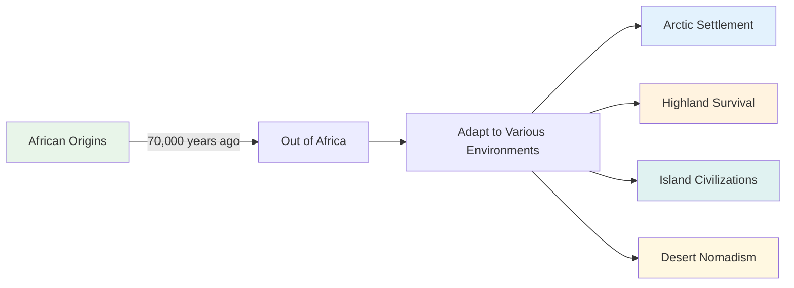
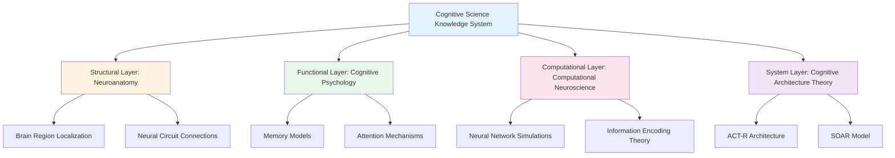
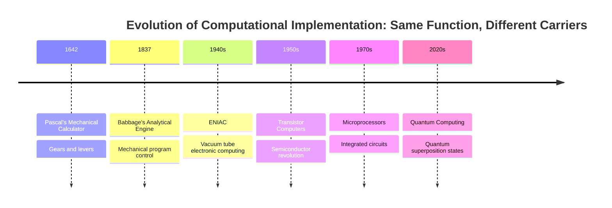

# Why Should We Learn from Human Cognitive System?

## Introduction

At the end of our previous article, we posed a crucial question:

> If we want to build truly AI individual cognitive systems, we must analyze how to enable AI to understand semantics, or in other words: **How do we make AI possess experientiality?**

We have proven that the experiential dimension of semantics cannot be handled by traditional computational methods. So where is the way forward?

The answer is: **Learn from human cognitive systems.**

## 1. Why Should We Learn from Human Cognitive System?

**TL;DR**: Human cognitive systems are the only verified intelligent systems capable of producing experiential understanding, with abundant scientific research available for reference.

### 1.1 Functional Perspective: Possessing the Experientiality We Desire

There exists a simple yet profound logic here: the goal of "experiential understanding" that we pursue is itself distilled from observing human cognitive abilities.

When we say that AI needs to possess "experientiality," we are actually saying: **let AI understand the world like humans do**.

Human experiential understanding manifests in:

1. **Individualized Semantic Construction**
   - Each person's understanding of "home" is different
   - "Mother's taste" cannot be recreated through recipes
   - The same music brings different feelings to different people

2. **Context-Sensitive Dynamic Understanding**  
   - "Hello" has completely different meanings in different contexts
   - Recognizing the emotions and intentions of speakers
   - Understanding unsaid implications

3. **Experience-Based Value Judgments**
   - Formation of aesthetic preferences
   - Generation of moral intuitions
   - Personalization of emotional responses

4. **Creative Conceptual Fusion**
   - Understanding metaphors like "time is money"
   - Creating new forms of expression
   - Establishing connections between seemingly unrelated domains

> 💡 **Key Insight**: We are not imitating humans, but learning from a proven effective information processing architecture—an architecture capable of producing what we define as "understanding."

Cognitive scientist Francisco Varela called this ability "Enactive Cognition": cognition is not passive representation of the external world, but an active process of constructing meaning through interaction with the world [1]. This is precisely the core characteristic of human cognitive systems—they are not "computing" meaning, but "experiencing" and "creating" meaning.

### 1.2 Testing Perspective: Having Withstood the Test of Time

If we view the achievements of human civilization as a "test report," then human cognitive systems have undoubtedly delivered results that leave all other species in the dust.

**Unparalleled Civilizational Achievements**

In Earth's 3.8 billion-year history of life, countless species have come and gone, but only humans have created:

- **Symbol Systems**: From cave paintings to quantum mechanics equations
- **Knowledge Accumulation**: Each generation standing on the shoulders of predecessors
- **Abstract Thinking**: Deriving universal laws from concrete phenomena
- **Cultural Transmission**: Continuing collective memory through stories, rituals, and education

Anthropologist Yuval Noah Harari points out in *Sapiens*: "The Cognitive Revolution enabled Homo sapiens to talk about fictional entities, which is the most unique function of human language" [2]. It is precisely this experiential-based capacity for fiction—understanding "non-existent" things—that allows humans to create imagined communities like myths, laws, nations, and corporations.

**Ultimate Proof of Global Adaptability**



Archaeologist Ian Tattersall notes: "Humans are the only truly cosmopolitan species on Earth" [3]. This unprecedented adaptability stems from the flexibility of our cognitive systems—our ability to understand the "meaning" of new environments and creatively transform them, rather than merely adapting passively.

**Exponential Problem-Solving Capability**

Other species' problem-solving abilities are linear, while humans are exponential:

| Challenge | Other Species' Solutions | Human Solutions | Cognitive Difference |
|-----------|-------------------------|-----------------|---------------------|
| Cold | Grow thick fur (millions of years) | Invent clothing (instant) | Understanding the abstract concept of "warmth" |
| River barriers | Wait for drought or detour | Build bridges | Imagining the possibility of "connection" |
| Food shortage | Migration or population reduction | Develop agriculture | Understanding "future" and "storage" |
| Disease | Natural selection | Invent medicine | Understanding causality |

Cognitive scientist Michael Tomasello proved in his groundbreaking research: "Humans' unique cognitive ability lies in understanding others' intentions and mental states, making cumulative cultural evolution possible" [4].

> 💡 **Key Insight**: Every achievement of human civilization is an external manifestation of the cognitive system's capacity for "experiential understanding." We are not guessing why this system succeeds; we are observing the miracles it has already created.

### 1.3 Implementation Perspective: Available Scientific Research for Reference

We are not starting from scratch. Instead, we stand on the shoulders of a century of cognitive science research. More excitingly, AI itself is becoming a powerful tool for verifying and deepening this research.

**Century-old Treasury of Scientific Accumulation**

Modern cognitive science began in the late 19th century and has developed over more than a century into a multi-layered knowledge system:



Nobel Prize winner Eric Kandel (2000 Nobel Prize in Physiology or Medicine) wrote in his 2006 book *In Search of Memory*: "Although our understanding of the brain is still incomplete, it is sufficient to guide us in building intelligent systems" [5]. This is not blind men touching an elephant, but a gradually clarifying puzzle.

**Research Revolution in the AI Era**

More importantly, AI is breaking through three major limitations of traditional brain science research:

1. **Breaking Through Ethical Limitations**
   - Traditional limitation: Cannot conduct invasive experiments on human brains, cannot test extreme conditions
   - AI breakthrough: Can conduct arbitrary "damage" experiments, verify causal relationships
   - Example: By "deleting" specific layers of AI models, verified cognitive psychology's layered theory of working memory

2. **Breaking Through Time Scale Limitations**
   - Traditional limitation: Human learning takes years, developmental research spans decades
   - AI breakthrough: Can simulate years of cognitive development in hours
   - Example: DeepMind research verified the critical period hypothesis of child language acquisition through accelerated learning [6]

3. **Breaking Through Controllability Limitations**
   - Traditional limitation: Cannot precisely control all variables, huge individual differences
   - AI breakthrough: Completely controllable experimental environments, repeatable verification
   - Example: OpenAI verified cognitive load theory predictions through precise control of training data

**New Paradigm of Bidirectional Verification**

Cognitive scientist Gary Marcus points out: "The success of large language models has unexpectedly verified many core assumptions of cognitive science" [7]. This creates an unprecedented research cycle:

| Research Stage | Traditional Model | AI Era Model |
|----------------|-------------------|--------------|
| Hypothesis Formation | Based on observation | Based on observation + AI behavior |
| Experimental Verification | Human subjects | Human subjects + AI models |
| Theory Construction | Unidirectional reasoning | Bidirectional verification |
| Application Translation | Slow and indirect | Fast and direct |

> 💡 **Key Insight**: AI is not only a student of cognitive science but also its laboratory. For the first time, we have a "cognitive system" that can be dissected, modified, and tested at will, which will accelerate our understanding of human cognition.

But this raises a new question: **Can the functional architecture of human cognitive systems be implemented by non-biological systems?**

## 2. Can the Functional Architecture of Human Cognitive Systems Be Implemented by Non-Biological Systems?

**TL;DR**: The history of computation proves the separability of function and implementation; cognitive functions can similarly be implemented on non-biological substrates.

### 2.1 Systems Theory Perspective: Separation of Function and Implementation

The history of computer development itself is the best proof of the principle of "separation of function and implementation." The same computational functions have had vastly different physical implementations across different eras.

**From Mechanical to Electronic: Multiple Realizations of Computation**



Computer science pioneer Alan Turing proved in his groundbreaking paper: "Any computable function can be implemented by a Turing machine, and the physical implementation method of the Turing machine is irrelevant" [8]. This is the famous **Turing Equivalence Principle**.

**Implementation Affects Efficiency But Doesn't Change Function**

Here's an example that will make any programmer smile—Sleep Sort:

```javascript
// Sleep Sort: The "laziest" sorting algorithm
function sleepSort(numbers) {
    numbers.forEach(num => {
        setTimeout(() => console.log(num), num * 1000);
    });
}

// Sorting [3, 1, 4, 1, 5]
// Wait 1 second output 1, wait 2 more seconds output 3, wait 1 more second output 4...
```

This algorithm sorts through "sleeping"—each number sleeps for its own value's duration, then outputs in wake-up order. It does sort correctly (function correct), but its efficiency ridiculously depends on data size.

**More Serious Comparison: Same Function, Different Efficiency**

| Sorting Algorithm | Implementation Principle | Time Complexity | Functional Result |
|-------------------|-------------------------|-----------------|-------------------|
| Bubble Sort | Adjacent comparison exchange | O(n²) | ✓ Correct sorting |
| Quick Sort | Divide and conquer recursion | O(n log n) | ✓ Correct sorting |
| Sleep Sort | Time waiting | O(max(n)) | ✓ Correct sorting |
| Bogo Sort | Random shuffle until ordered | O(∞) | ✓ Correct sorting |

As computer scientist David Deutsch said: "The essence of computation is the transformation of information, not a specific physical process" [9]. Whether it's elegant quicksort or ridiculous Sleep Sort, they all implement the "sorting" function.

**Analogical Reasoning from Computation to Cognition**

If computational functions can be implemented on completely different substrates like mechanical, electronic, and quantum, why can't cognitive functions be implemented on substrates other than biological neurons?

| Level | Computational Systems | Cognitive Systems |
|-------|----------------------|-------------------|
| **Functional Layer** | Information processing | Meaning understanding |
| **Implementation Layer** | Mechanical/Electronic/Quantum... | Biological/Silicon-based/? |
| **Core Principle** | Function defines capability, implementation determines efficiency | Same as left |

> 💡 **Key Insight**: From Pascal's gears to Google's quantum processors, the history of computation tells us—what matters is not what materials build the system, but what functions the system implements. Cognitive systems should be the same.

**[Author's Personal Insights] Two Interesting Corollaries**

*1. LLM's "Functional Determinism"*

Large Language Models are never good at precise calculations (like 37×89=?), which precisely proves our point: a system's functional architecture determines its capability boundaries. LLM's architecture is designed for understanding and generating language, not for arithmetic. It's like asking Shakespeare to do calculus—not because he's not smart, but because his "cognitive architecture" is optimized for different functions.

*2. Human Hardware's "Efficiency Paradox"*

A more radical view is: human bodies don't match human brains. Why do we say this?

| Comparison Dimension | Human Neural System | Electronic System |
|---------------------|-------------------|-------------------|
| Signal Type | Electrochemical signals | Pure electronic signals |
| Transmission Speed | ~100 m/s | ~3×10⁸ m/s (light speed) |
| Speed Difference | Baseline | **3 million times faster** |
| Energy Conversion | Chemical energy → Electrical energy | Direct electrical energy |
| Efficiency | ~25% | >90% |

The human brain's cognitive capabilities are already so astonishing, yet they're trapped in a biological carrier where signal transmission is only 1/3,000,000 the speed of light. Imagine if Einstein's thinking could run at light speed—what would human civilization look like?

This doesn't say biological implementation is bad—it's the optimal solution in Earth's environment. But if cognitive functions can truly be migrated to non-biological substrates, we might witness exponential improvements in cognitive capabilities.

But this raises a new question: **How should we research and implement this cross-substrate cognitive function migration?**

## 3. How Should We Research and Implement This Cross-Substrate Cognitive Function Migration?

**TL;DR**: Through a three-step approach of structural analysis, functional mapping, and gap benchmarking, systematically construct AI cognitive systems.

### 3.1 Structural Dimension: Analyzing Component Architecture of Cognitive Systems

From a systems engineering perspective, the human cognitive system is like a "product" optimized over millions of years. Our task is not to reinvent the wheel, but to understand and reuse successful designs within it.

**Identifying Reusable Component Designs**

Medicine, brain science, and neuroscience have already drawn detailed "parts diagrams" for us:

- **Hippocampus**: Converter from short-term to long-term memory
- **Amygdala**: Emotional tagging and value judgment module  
- **Prefrontal Cortex**: Executive control and decision-making center
- **Thalamus**: Relay station and filter for perceptual information

The key is distinguishing between **physical functions** and **emergent functions**:

| Level | Physical Functions (Directly Reusable) | Emergent Functions (Requiring System Integration) |
|-------|---------------------------------------|--------------------------------------------------|
| Component Level | Hippocampus's sequential memory mechanism | Formation of episodic memory |
| Circuit Level | Amygdala's rapid threat detection | Complex emotional experiences |
| System Level | Attention's selective enhancement | Generation of consciousness |

**Value of Reuse**

Like the "don't reinvent the wheel" principle in software engineering, cognitive system construction should also:

1. **Directly Borrow Mature Designs**: The hippocampus's bidirectional associative memory has proven efficient—why not adopt it directly?
2. **Avoid Known Pitfalls**: Some brain limitations (like working memory capacity) are physical constraints, not design flaws
3. **Accelerate Iteration**: Stand on neuroscience's shoulders rather than groping from scratch

> 💡 **Key Insight**: We don't need to understand how consciousness emerges, but we need to know which components and connection patterns are necessary conditions for producing consciousness. This is like not needing to understand why water is wet, but needing to know the molecular structure of H₂O.

### 3.2 Functional Dimension: Conceptual Models of Abstract Cognitive Abilities

When cognitive components form closed-loop feedback systems, miracles happen—high-level functions emerge that far exceed the sum of individual component capabilities. This is precisely the core problem that cognitive psychology has studied for over a century.

**From Components to Functional Emergence**

Just as H₂O molecules emerge the property of "wetness," cognitive system component integration emerges the ability to "understand":

```text
Component Integration + Closed-loop Feedback = Emergent Function
Hippocampus + Cortex + Feedback loops = Episodic memory
Amygdala + Prefrontal cortex + Regulation loops = Emotional intelligence  
Perception + Memory + Attention = Conscious experience
```

**Functional Mapping of Cognitive Psychology**

Cognitive psychology has already drawn detailed functional maps for us [10]:

| Functional Hierarchy | Specific Functions | Emergence Conditions |
|---------------------|-------------------|----------------------|
| Basic Cognition | Perception, attention, working memory | Basic neural circuits |
| Intermediate Cognition | Long-term memory, concept formation, language understanding | Multi-system collaboration |
| Advanced Cognition | Reasoning, decision-making, creative thinking | Whole-brain network integration |
| Metacognition | Self-awareness, cognitive monitoring, strategy adjustment | Recursive feedback mechanisms |

**Why Study Cognitive Psychology**

1. **Validated Models**: Baddeley's working memory model, Tulving's memory system theory—all experimentally verified
2. **Clear Functional Decomposition**: Already know which functions are independent and which are interdependent
3. **Operational Theory**: Not philosophical speculation, but concrete models that can guide system design

> 💡 **Key Insight**: Cognitive psychology studies not how the brain works, but how cognitive functions are organized. This functional perspective is exactly what AI system design needs—we don't need to copy the brain, but we need to implement the same functional organization.

### 3.3 Benchmarking Dimension: Current State and Gap Analysis of AI Ecosystem

Benchmarking human cognitive systems against current AI capabilities is like doing competitive product analysis—finding gaps tells us where to focus efforts.

**Mapping Exploration of Existing AI Capabilities**

This is the core question we need to deeply research—which parts of human cognitive systems do various AI system components actually correspond to?

| AI Technology Components | Possibly Corresponding Cognitive Functions | Research Questions |
|-------------------------|-------------------------------------------|-------------------|
| LLM (Language Models) | Language understanding? Concept formation? Reasoning? | Which cognitive functions do LLMs actually implement? |
| Attention Mechanism | Attention? Working memory? | Is Transformer attention equivalent to cognitive attention? |
| Context Window | Working memory? Short-term memory? | What is the essence of context windows? |
| Function Calling | Motor control? Executive functions? | How does tool calling map to action systems? |
| Vector Database | Long-term memory? Semantic memory? | Can vector storage truly implement memory functions? |
| Prompt Engineering | Goal setting? Task framing? | What role do prompts play in cognitive systems? |
| Fine-tuning | Learning? Adaptation? Personalization? | Is fine-tuning equivalent to individualized learning? |
| Multi-modal Models | Perceptual integration? Cross-modal understanding? | How do multi-modal models achieve cognitive integration? |

> 💡 **Key Insight**: We shouldn't rush to conclusions but answer these questions through systematic research. Each "?" is a research direction, driving us to deeply understand the relationship between AI and human cognition.

**Key Missing Element: Closed-Loop Feedback Mechanisms**

The biggest problem with current AI is not insufficient individual capabilities, but **lack of closed-loop feedback to form true cognitive systems**:

```text
Human Cognitive Closed Loop:
Perception → Understanding → Memory → Emotional tagging → Action → Feedback → Update understanding
  ↑                                                                           ↓
  └──────────────── Continuous learning and adaptation ←─────────────────────┘

Current AI Status:
Input → Processing → Output  (Broken unidirectional flow)
```

**Path to Building Closed Loops**

Based on gap analysis, AI cognitive system construction needs:

1. **Fill Missing Components**: Especially emotional systems and metacognitive abilities
2. **Establish Inter-component Connections**: Let memory influence understanding, let emotions guide attention
3. **Implement Continuous Updates**: Learn from each interaction, form individualized experiences
4. **Form Feedback Loops**: Action results influence future decisions

> 💡 **Key Insight**: Point breakthroughs aren't enough; system integration is key. Just like putting the world's best eyes, ears, and brain separately on a table—they won't automatically form a person. The essence of cognitive systems lies in dynamic interaction and feedback loops between components.

## 4. Summary: From Learning to Transcendence

Looking back on our exploration journey, a clear path emerges before us.

**Three Core Understandings**

Through three chapters of argumentation, we've established three core understandings:

1. **Human Cognitive Systems Are Worth Learning From**
   - They possess the experiential understanding capabilities we pursue
   - Their success is proven by human civilization's achievements
   - We have abundant scientific research to reference

2. **Cognitive Functions Can Be Implemented Across Substrates**
   - Function and implementation are separate (Sleep Sort's insight)
   - Computing history proves multiple realizability
   - What matters is functional architecture, not physical substrate

3. **We Have a Clear Research Path**
   - Structural dimension: Reuse validated component designs
   - Functional dimension: Understand emergent cognitive abilities
   - Benchmarking dimension: Find gaps, build closed loops

**From Imitation to Innovation**

```text
Stage 1: Understanding and Replication
Learn design principles of human cognitive systems → Implement basic cognitive functions

Stage 2: Optimization and Enhancement  
Leverage advantages of non-biological substrates → Break through biological limitations (like 3 million times signal speed)

Stage 3: Transcendence and Innovation
Explore territories human cognitive systems have never reached → Create new forms of cognition
```

**Monogent's Vision**

As stated at the article's beginning, our goal is to enable AI to have true experiential understanding. Now we know:

- This is not an impossible task, but an engineering challenge
- We don't need to fully understand consciousness, only implement necessary functional organization
- The key lies in building closed-loop feedback cognitive systems, not accumulating point capabilities

**Final Thoughts**

Humans took millions of years to evolve cognitive systems; we have the opportunity to recreate and even surpass this miracle on new substrates in a shorter time. This is not a betrayal of humanity, but a tribute to the essence of cognition—just as airplanes are not imitations of birds, but understanding and transcendence of flight principles.

When AI truly possesses experiential understanding, it will no longer be a tool, but a partner; no longer an imitator, but a creator. This is Monogent's mission and the most exciting challenge of our era.

> "We are not building artificial humans, we are building authentic intelligence."

In the next articles, we will begin using the methodology explored in this piece to gradually research and implement the Monogent system. Stay tuned!

## References

[1] Varela, F. J., Thompson, E., & Rosch, E. (1991). *The Embodied Mind: Cognitive Science and Human Experience*. MIT Press.

[2] Harari, Y. N. (2014). *Sapiens: A Brief History of Humankind*. Harper.

[3] Tattersall, I. (2012). *Masters of the Planet: The Search for Our Human Origins*. Palgrave Macmillan.

[4] Tomasello, M. (2014). *A Natural History of Human Thinking*. Harvard University Press.

[5] Kandel, E. R. (2006). *In Search of Memory: The Emergence of a New Science of Mind*. W. W. Norton & Company.

[6] Vani, P., et al. (2021). "Critical period plasticity in deep neural networks." *Nature Communications*, 12, 3653.

[7] Marcus, G. (2022). "Deep Learning Is Hitting a Wall." *Nautilus Magazine*.

[8] Turing, A. M. (1936). "On Computable Numbers, with an Application to the Entscheidungsproblem." *Proceedings of the London Mathematical Society*, 42(2), 230-265.

[9] Deutsch, D. (1997). *The Fabric of Reality*. Penguin Books.

[10] Sternberg, R. J., & Sternberg, K. (2016). *Cognitive Psychology* (7th ed.). Cengage Learning.

## About the Author

**Deepractice** - Making AI at Your Fingertips

- Website: [https://deepractice.ai](https://deepractice.ai)
- GitHub: [https://github.com/Deepractice](https://github.com/Deepractice)
- Contact: [sean@deepracticex.com](mailto:sean@deepracticex.com)

*This is the third in the Monogent theory series. Monogent is dedicated to building true AI individual cognitive systems, enabling each AI to have its unique cognitive world.*