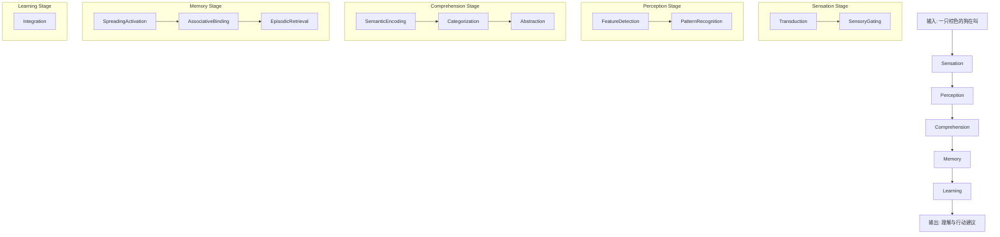

# 认知Stages示例：看到一只狗在叫

本示例展示高级认知功能（Stages）如何组合底层机制（Steps）来完成认知任务。

## 场景描述

输入：文本描述"一只棕色的狗在叫"

## 认知架构层次回顾

1. **Steps层**（具体机制）- 底层的认知机制，描述"怎么做"
2. **Stages层**（功能抽象）- 中间层的认知功能，描述"做什么"  
3. **Phases层**（流程组织）- 最高层的认知阶段

## Stages设计理念

Stages代表认知心理学中的高级功能概念，每个Stage组合多个Steps来实现特定认知功能。

## 核心Stages定义

### 1. Sensation（感觉）
**定义**：接收和转换原始感觉信号

**理论基础**：
- Sensory Processing（感觉加工）：物理刺激到神经信号
- Signal Detection Theory（信号检测理论）：区分信号与噪音

**包含的Steps**：
1. Transduction（转导）- 物理信号转换
2. SensoryGating（感觉门控）- 丘脑层面的初步过滤

**处理示例**：
```
输入：原始文本 "一只棕色的狗在叫"
↓ Transduction: 文本信号接收
↓ SensoryGating: 相关性过滤（全部通过）
输出：过滤后的感觉信号
```

### 2. Perception（知觉）
**定义**：将感觉信号组织成有意义的知觉体验

**理论基础**：
- Gestalt Psychology（格式塔心理学）：整体大于部分之和
- Feature Integration Theory（特征整合理论）：特征绑定成对象

**包含的Steps**：
1. FeatureDetection（特征检测）- 基本特征提取
2. PatternRecognition（模式识别）- 形成知觉整体

**处理示例**：
```
输入：过滤后的感觉信号
↓ FeatureDetection: 词汇特征识别
↓ PatternRecognition: 形成完整知觉
输出：知觉体验 "一只棕色的狗在叫"（内心语言形式）
```

### 3. Comprehension（理解）
**定义**：将知觉信息转换为语义理解

**理论基础**：
- Kintsch's Construction-Integration Model（建构-整合模型）
- Schema Theory（图式理论）：用已有知识框架理解新信息

**包含的Steps**：
1. SemanticEncoding（语义编码）- 转换为AMR
2. Categorization（分类）- 概念归类
3. Abstraction（抽象）- 提取模式

**处理示例**：
```
输入：知觉体验 "一只棕色的狗在叫"
↓ SemanticEncoding: 生成AMR结构
↓ Categorization: dog→动物, bark→声音事件
↓ Abstraction: AGENT-ACTION模式
输出：语义理解（AMR + 类别 + 模式）
```

### 4. Memory（记忆）
**定义**：激活、绑定和检索相关记忆

**理论基础**：
- Tulving's Memory Systems（记忆系统）：语义记忆vs情景记忆
- Encoding Specificity Principle（编码特异性原则）

**包含的Steps**：
1. SpreadingActivation（扩散激活）- 激活相关记忆
2. AssociativeBinding（联想绑定）- 建立连接
3. EpisodicRetrieval（情景检索）- 重建记忆

**处理示例**：
```
输入：AMR语义结构 + 抽象模式
↓ SpreadingActivation: 激活"邻居狗叫"等记忆
↓ AssociativeBinding: 当前↔记忆映射
↓ EpisodicRetrieval: "上次是快递员来了"
输出：相关记忆和经验
```

### 5. Learning（学习）
**定义**：将新体验整合进知识网络

**理论基础**：
- Consolidation Theory（巩固理论）：从短期到长期记忆
- Connectionist Models（连接主义模型）：知识的网络表征

**包含的Steps**：
1. Integration（整合）- 记忆巩固和网络更新

**处理示例**：
```
输入：当前体验 + 激活的记忆
↓ Integration: Hebbian学习 + 优先连接
输出：更新的记忆网络（新节点 + 新连接）
```

## 高级Stages（可选扩展）

### 6. Attention（注意）
**定义**：选择性地处理相关信息

**理论基础**：
- Posner's Attention Networks（注意网络）
- Feature Integration Theory（特征整合理论）

**潜在Steps组合**：
- 可以影响SensoryGating的过滤强度
- 可以调节SpreadingActivation的激活模式

### 7. Reasoning（推理）
**定义**：基于理解和记忆进行推断

**理论基础**：
- Mental Models Theory（心理模型理论）
- Dual Process Theory（双加工理论）

**潜在Steps组合**：
- 使用Abstraction提取的模式
- 结合Memory中的经验
- 生成新的推论

### 8. Metacognition（元认知）
**定义**：对自己认知过程的监控和调节

**理论基础**：
- Metacognitive Knowledge（元认知知识）
- Metacognitive Regulation（元认知调节）

**潜在功能**：
- 监控理解的置信度
- 调整认知策略
- 识别知识缺口

## Stages的优势

1. **功能聚合**：每个Stage代表一个完整的认知功能
2. **理论对应**：直接对应认知心理学的核心概念
3. **灵活组合**：可以根据任务需求选择性激活
4. **清晰抽象**：隐藏底层实现细节，提供清晰接口

## 完整认知流程



## 实现指导

每个Stage应该：
1. 有清晰的认知心理学理论基础
2. 组合适当的Steps完成功能
3. 提供简洁的对外接口
4. 隐藏内部Steps的复杂性
5. 支持与其他Stages的流畅衔接