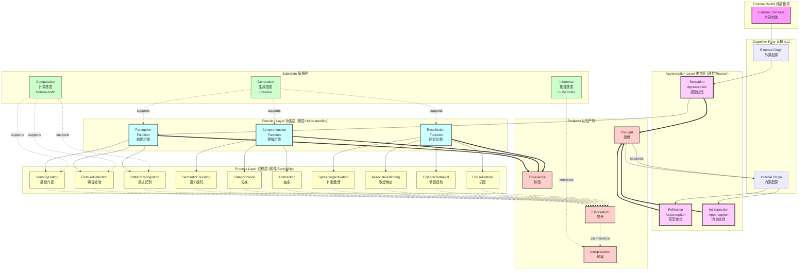

# Monogent Cognitive Architecture

## Overview

The Monogent cognitive architecture is a three-layer system that combines Kantian philosophy, cognitive psychology, and modern AI technology. It models cognition as a recursive process where thoughts can become new origins for further cognitive processing.

## Architecture Diagram



## Layer Descriptions

### 1. Cognitive Entry Points

- **External Origin**: Stimuli from the external world
- **Internal Origin**: Thoughts from internal cognitive processes

### 2. Three-Layer Cognitive Architecture

#### Apperception Layer (Reason/Vernunft)

The highest layer of cognition, representing unified self-consciousness. Apperception unifies sensory input (Origin) with intellectual understanding (Function) to produce Thought.

- **Sensation Apperception**: Processes external stimuli
- **Reflection Apperception**: Processes thoughts about experiences
- **Introspection Apperception**: Processes thoughts about thoughts

**Produces**: Thought (self-aware cognitive content)

#### Function Layer (Understanding/Verstand)

The middle layer that applies concepts and categories to organize experience.

- **Perception**: Organizes sensory information into meaningful patterns
- **Comprehension**: Applies semantic understanding to create meaning
- **Recollection**: Retrieves and reconstructs memories

**Produces**: Experience (conceptualized cognitive content)

#### Process Layer (Sensibility/Sinnlichkeit)

The foundational layer that performs basic cognitive operations on raw materials.

- **Sensory Processes**: SensoryGating, FeatureDetection, PatternRecognition
- **Semantic Processes**: SemanticEncoding, Categorization, Abstraction
- **Memory Processes**: SpreadingActivation, AssociativeBinding, EpisodicRetrieval, Consolidation

**Produces**: Elaboration (organized sensory material)

### 3. Substrate Support Layer

The computational foundation that enables cognitive processes:

- **Computation Substrate**: Supports deterministic, fast processing (Type 1)
- **Generation Substrate**: Supports creative, interpretive processing (Type 2)
- **Inference Substrate**: Interfaces with LLM for semantic interpretation

### 4. Cognitive Products

- **Elaboration**: Raw cognitive material organized by processes
- **Experience**: Unified cognitive content with conceptual understanding
- **Interpretation**: Semantic meaning derived through inference
- **Thought**: Self-aware cognitive content that includes "I think"

## Cognitive Cycle

The architecture supports recursive cognition where:

1. External stimuli enter through sensation apperception
2. Thoughts produced can become internal origins
3. Internal origins can trigger reflection or introspection
4. This creates an infinite recursive loop of self-aware cognition

## Philosophical Foundations

### Kantian Mapping

- **Sensibility (Process)**: Organizes intuitions in space and time
- **Understanding (Function)**: Applies categories to intuitions
- **Reason (Apperception)**: Unifies under transcendental apperception

### Cognitive Psychology

- **Type 1 Processing**: Fast, automatic (Computation substrate)
- **Type 2 Processing**: Slow, controlled (Generation substrate)
- **Metacognition**: Thinking about thinking (Apperception layer)

## Key Insights

1. **Experience as Universal Carrier**: All cognitive content is carried as Experience
2. **Thought as Recursive Origin**: Thoughts can trigger new cognitive cycles
3. **Three-Layer Products**:
   - Process → Elaboration
   - Function → Experience
   - Apperception → Thought
4. **Unity of Consciousness**: The "I think" accompanies all cognition through apperception

## Cognitive Data Flow - Spiral Recursion

The following diagram illustrates how cognitive products (Elaboration, Experience, Thought) form a spiral recursive flow, where each level of cognition builds upon and transcends the previous:

```mermaid
graph TD
    subgraph "Level 1: Initial Perception"
        O1[Origin<br/>外部刺激] 
        P1[Process<br/>感性加工]
        E1[Elaboration<br/>感性材料]
        F1[Function<br/>知性理解]
        EX1[Experience<br/>概念体验]
        A1[Apperception<br/>统觉]
        T1[Thought<br/>思想]
    end
    
    subgraph "Level 2: Reflection"
        O2[Origin<br/>= Thought 1]
        P2[Process<br/>反思加工]
        E2[Elaboration<br/>反思材料]
        F2[Function<br/>深度理解]
        EX2[Experience<br/>反思体验]
        A2[Apperception<br/>元认知]
        T2[Thought<br/>高阶思想]
    end
    
    subgraph "Level 3: Meta-Cognition"
        O3[Origin<br/>= Thought 2]
        P3[Process<br/>元认知加工]
        E3[Elaboration<br/>元认知材料]
        F3[Function<br/>哲学理解]
        EX3[Experience<br/>自我意识]
        A3[Apperception<br/>纯粹理性]
        T3[Thought<br/>先验思想]
    end
    
    %% Level 1 Flow
    O1 --> P1
    P1 --> E1
    E1 --> F1
    F1 --> EX1
    EX1 --> A1
    A1 --> T1
    
    %% Level 2 Flow
    T1 ==>|becomes| O2
    O2 --> P2
    P2 --> E2
    E2 --> F2
    F2 --> EX2
    EX2 --> A2
    A2 --> T2
    
    %% Level 3 Flow
    T2 ==>|becomes| O3
    O3 --> P3
    P3 --> E3
    E3 --> F3
    F3 --> EX3
    EX3 --> A3
    A3 --> T3
    
    %% Spiral indication
    T3 ==>|continues...| O4[...]
    
    %% Elaboration accumulation
    E1 -.->|accumulates| E2
    E2 -.->|accumulates| E3
    
    %% Experience enrichment
    EX1 -.->|enriches| EX2
    EX2 -.->|enriches| EX3
    
    %% Styles
    classDef origin fill:#f9f,stroke:#333,stroke-width:2px
    classDef process fill:#ffc,stroke:#333,stroke-width:1px
    classDef elaboration fill:#ffe,stroke:#333,stroke-width:1px
    classDef function fill:#cff,stroke:#333,stroke-width:2px
    classDef experience fill:#aff,stroke:#333,stroke-width:2px
    classDef apperception fill:#fcf,stroke:#333,stroke-width:3px
    classDef thought fill:#fcc,stroke:#333,stroke-width:3px
    
    class O1,O2,O3 origin
    class P1,P2,P3 process
    class E1,E2,E3 elaboration
    class F1,F2,F3 function
    class EX1,EX2,EX3 experience
    class A1,A2,A3 apperception
    class T1,T2,T3 thought
```



### Data Flow Characteristics

1. **Elaboration Accumulation**
   - Each Process adds new elaborative material
   - Elaborations accumulate across levels
   - Forms an expanding chain of cognitive materials

2. **Experience Enrichment**
   - Each Function produces richer Experience
   - Experiences build upon previous understanding
   - Creates deepening semantic comprehension

3. **Thought Recursion**
   - Each Thought becomes Origin for next level
   - Creates infinite recursive spiral
   - Enables self-aware meta-cognition

### Cognitive Levels

1. **Level 1 - Perception**: External stimulus → Basic thought
   - Origin: External world
   - Product: Initial understanding

2. **Level 2 - Reflection**: Thought about experience
   - Origin: Previous thought
   - Product: Reflective understanding

3. **Level 3 - Meta-Cognition**: Thought about thinking
   - Origin: Reflective thought
   - Product: Self-aware understanding

### The Spiral Nature

The cognitive process forms a spiral rather than a circle because:

- Each iteration adds new layers of understanding
- Elaborations accumulate without loss
- Experiences become progressively enriched
- Thoughts achieve higher levels of abstraction

This spiral can continue indefinitely, limited only by:

- Computational resources
- Attention span
- Relevance to current goals

## Data Structure Nesting - Chain Containment

The following diagram shows how cognitive data structures form nested chains, where each higher-level structure contains and builds upon lower-level chains:

```mermaid
graph TD
    subgraph "Thought Chain"
        T1[Thought 1]
        T2[Thought 2]
        T3[Thought 3]
        
        subgraph "Experience Chain (within Thought)"
            E1[Experience 1]
            E2[Experience 2]
            E3[Experience 3]
            
            subgraph "Elaboration Chain (within Experience)"
                EL1[Elaboration 1]
                EL2[Elaboration 2]
                EL3[Elaboration 3]
                EL4[Elaboration 4]
                
                EL1 -->|previous| EL2
                EL2 -->|previous| EL3
                EL3 -->|previous| EL4
            end
            
            E1 -->|previous| E2
            E2 -->|previous| E3
            
            E1 -.->|contains| EL1
            E2 -.->|contains| EL2
            E3 -.->|contains| EL4
        end
        
        T1 -->|previous| T2
        T2 -->|previous| T3
        
        T1 -.->|contains| E1
        T2 -.->|contains| E2
        T3 -.->|contains| E3
    end
    
    %% Data structure details
    subgraph "Data Structure Details"
        TStruct["Thought {<br/>  content: Experience<br/>  origin: Origin<br/>  process: Evolution<br/>  previous?: Thought<br/>}"]
        
        EStruct["Experience {<br/>  elaboration?: Elaboration<br/>  interpretation?: Interpretation<br/>  origin?: Origin<br/>  previous?: Experience<br/>}"]
        
        ELStruct["Elaboration {<br/>  prompt: string<br/>  schema?: JSONSchema<br/>  source?: string<br/>  previous?: Elaboration<br/>}"]
    end
    
    %% Relationships
    TStruct ==>|contains| EStruct
    EStruct ==>|contains| ELStruct
    
    %% Styles
    classDef thought fill:#fcc,stroke:#333,stroke-width:3px
    classDef experience fill:#aff,stroke:#333,stroke-width:2px
    classDef elaboration fill:#ffe,stroke:#333,stroke-width:1px
    classDef struct fill:#eee,stroke:#333,stroke-width:1px,stroke-dasharray: 5 5
    
    class T1,T2,T3 thought
    class E1,E2,E3 experience
    class EL1,EL2,EL3,EL4 elaboration
    class TStruct,EStruct,ELStruct struct
```



### Chain Characteristics

1. **Elaboration Chain** (Innermost)
   - Each Process adds an Elaboration node
   - Forms a linked list via `previous` pointer
   - Accumulates all processing steps
   - Contained within Experience

2. **Experience Chain** (Middle)
   - Each Function creates an Experience node
   - Links to previous Experience
   - Contains the Elaboration chain at that moment
   - Contained within Thought

3. **Thought Chain** (Outermost)
   - Each Apperception creates a Thought node
   - Links to previous Thought (if from reflection)
   - Contains the full Experience with its history
   - Can become Origin for new cognitive cycles

### Nesting Relationships

```
Thought
├── content: Experience
│   ├── elaboration: Elaboration
│   │   ├── prompt: string
│   │   └── previous: Elaboration
│   │       ├── prompt: string
│   │       └── previous: Elaboration...
│   └── previous: Experience
│       ├── elaboration: Elaboration...
│       └── previous: Experience...
└── previous: Thought
    ├── content: Experience...
    └── previous: Thought...
```

This nested structure enables:
- **Complete History**: Each Thought contains the full cognitive journey
- **Selective Access**: Can traverse any level of the chain independently
- **Memory Efficiency**: Shared references prevent duplication
- **Cognitive Archaeology**: Can reconstruct how any thought was formed
