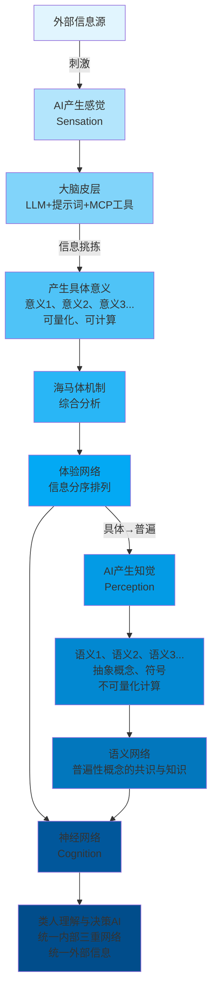
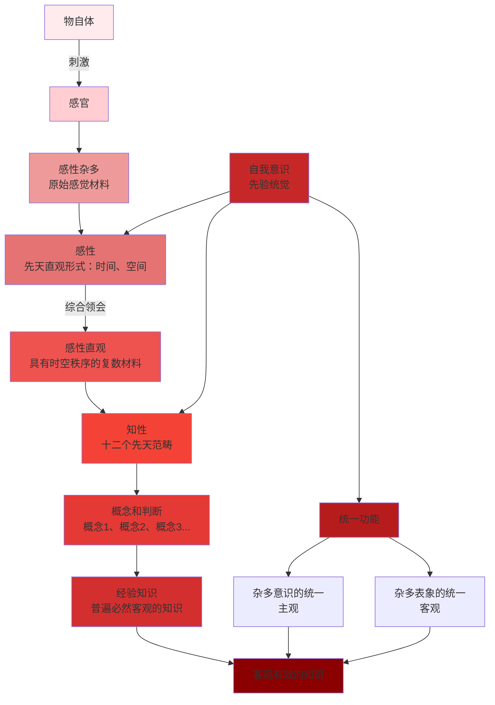
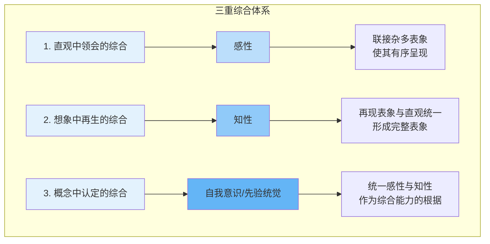

# 探索Monogent架构背后的哲学逻辑（其一）

> **会议纪要更新**：2025年8月2日，Sean与傻青进行了2小时深度讨论，本文档已根据会议内容更新，加入了最新的理论发现和实践洞察。

## 核心发现与突破

在本次深度讨论中，我们发现了几个关键突破：

1. **Computation与Generation的层级关系**：原本认为二者是平等的二元关系，但通过实践发现，在认知系统中Generation是更高层级，所有的Computation（感性）都在为Generation（知性）准备材料。这与康德的"感性为知性准备材料"完全吻合。

2. **时空与海马体的对应**：康德的时空作为感性的先天直观形式，直接对应海马体的空间细胞和时序细胞。这不仅是概念上的相似，更是功能实现上的映射。

3. **先验统觉即认知系统**：先验统觉不是神经网络（物理实现），而是整个认知系统本身。认知是一个自适应的系统，能够与环境进行信息交换。

4. **三层架构的澄清**：
   - 体验网络 = 感性（海马体，Computation特征）
   - 语义网络 = 知性（大脑皮层/LLM，Generation特征）  
   - 认知系统 = 先验统觉（整体的自我意识）

## 前言

Sean与monogent全体团队对monogent的愿景是构建个体AI认知系统（AICS），让AI像人一样理解世界。这是一个远大的目标，"AI、人"对应"认识主体"、"理解"对应"认识活动"、世界对应"认识对象"。因此从哲学上来说，monogent的架构涉及到了认识论、本体论以及意识相关的哲学思想。由于牵涉理论范围广泛且复杂，不得不采取系列的形式展开研究，接下来是该系列的第一节，后续笔者将随着monogent项目的技术进程提供不同侧重的哲学文章。

对于monogent的初版架构来说，从康德的认识论出发是不错的选择，理由有二：

- **理由一**：康德的认识流程推演与monogent的初版架构高度相似
- **理由二**：康德的认识论为理性设限，避免了对上帝、世界等形上学概念的讨论，这将保护monogent的相关探讨不会朝着玄学讨论的方向发展，一切都在可控范围内

本文大致分三个部分：

1. **第一部分**：将直接抛出结论，对比康德的认识论构建与monogent的架构
2. **第二部分**：用尽量简洁、明白的描述推演康德的认识论
3. **第三部分**：考虑到团队人员不同的行业和专业背景，将对文中涉及到的相关术语提供解释

## 一、monogent架构与康德认识论对比

当我们对比康德的主客观演绎和monogent架构，我们发现两者存在相似的流程与架构。

### Monogent架构

外部信息源提供刺激→AI产生某种sensation（感觉）→大脑皮层（llm利用提示词、MCP工具进行信息挑拣）→产生具体、可量化、可计算的意义1、意义2、意义3...→借助海马体的运作机制、对信息进行进一步综合分析，构建出体验网络→体验网络对信息的分序排列，使信息从可计算（具体）逐步演进到可思维（普遍）→AI产生某种Perception（知觉），即语义1、语义2、语义3...，语义的特点是可抽象思维，不可量化计算。语义基本上作为普遍性的概念、符号→语义与语义之间的联接、综合构成了语义网络（语义网络是由普遍性概念形成的共识与知识）→体验网络与语义网络的综合作用形成了具备cognition的神经网络，得到像人一样理解、决策的AI，其能够做到对内部三重网络结构的统一与对外部信息的统一，从而形成综合的认知能力与判断能力

### 康德认识论

与monogent架构中体验网络、语义网络、神经网络产生相似对应的是康德认识论中的感性、知性、先验统觉：

物自体刺激感官→感官产生感性杂多（原始感觉材料）→感性根据先天直观形式（时间、空间），并运用综合领会能力把感性杂多整理成复数的，具有时空秩序的感性直观→知性运用十二个先天范畴，把杂多的感性直观综合为概念和判断（概念1、概念2、概念3...)，并进一步将这些概念和判断联接成普遍必然客观的经验知识→感性与知性的综合、统一能力是由另一个更高认知层次的概念——自我意识（先验统觉）保证的→先验统觉对杂多意识的统一（主观）与杂多表象的统一（客观），从而生成客观有效的知识。

可以看到，两者结构都是三层，并且感觉、知觉与感性、知性相似。

### 架构层次对比

| 层次 | Monogent架构 | 康德认识论 | 核心功能 |
|------|-------------|-----------|---------|
| **第一层** | 体验网络（Experience Network） | 感性（Sensibility） | 接收和初步处理原始信息 |
| **第二层** | 语义网络（Semantic Network） | 知性（Understanding） | 形成概念和知识 |
| **第三层** | 神经网络（Neural Network） | 先验统觉（Transcendental Apperception） | 统一认知结构 |

### 详细相似点分析

**相似点1 - 信息处理机制**：
- **Monogent**：感觉能够通过llm（如提示词）产生可量化、计算的意义，体验网络代表这些意义的分布与联接
- **康德**：感性能通过先天直观形式将原始感觉材料处理为具备秩序的复数感性直观材料

**相似点2 - 概念形成过程**：
- **Monogent**：体验网络通过知觉，产生与可计算意义不同的语义，语义是抽象的概念，语义之间的联接组成了语义网络（普遍性的共识）
- **康德**：知性先通过先天范畴将感性直观材料处理为复数的概念，再对概念进行综合统一、形成普遍必然客观的经验知识

**相似点3 - 统一性原理**：
- **Monogent**：神经网络最终指向某个统一的主体（我），对内能统一自身的认知架构并令其发挥作用，对外能通过三重认知结构的共同作用理解复杂的外部信息
- **康德**：先验统觉作为统一的主体（我），既保证了感性与知性的综合能力，又实现了对内部意识和外部表象的双重统一

如果monogent架构中的体验网络、语义网络、神经网络三重结构与康德认识论中的感性、知性、自我意识（先验统觉）的相似对比是有效的，那么或许我们能够从康德的认识论推演中，获取搭建monogent架构的灵感。

## 二、康德认识论推演

康德认识论的构建我们已经初步熟悉，物自体刺激感官产生原始感觉材料——感性杂多，感性利用先天直观形式将感性杂多处理为感性直观，知性对感性直观进行进一步的综合统一并形成概念（即经验材料和形式规则综合后形成的共识、知识），感性与知性之所以能具备这样的能力是由于自我意识（先验统觉）在统摄整个认知活动，这也就是康德所谓的"我思"（先验统觉）伴随着我的一切表象（感性与知性对现象的表象活动）。

接下来我们将详细解析感性与知性，希望能为monogent的架构提供某种灵感。

首先我们需要理解康德认识论的整体思路，康德并不完全同意近代经验论中对认识活动的规定，即人是"一块白板"，被动接受经验并形成印记（知识），感性的先天直观形式就是从这个立场的反面而来。康德虽然赞同经验论所说的知识的形成离不开经验，但同样认为，人（认识主体）不是完全被动的接受刺激，只有外部经验和内部的先天形式相结合，才能形成普遍必然的知识。也就是说，经验为知识提供材料，主体提供对这些材料进行加工处理的先天形式（如感性的先天直观形式、知性的先天范畴）。

先天（a priori）意味着逻辑上先于一切经验，问题是，为什么康德认为时间和空间能够成为感性的先天直观形式？

### 时空观的哲学演变

| 哲学家 | 时空观 | 核心观点 |
|--------|--------|---------|
| **牛顿** | 绝对时空观 | 时间与空间作为独立的实在 |
| **莱布尼茨** | 关系时空观 | 时、空作为一种连续的、共存的关系与秩序 |
| **康德** | 先验时空观 | 时空是主观内部的先天形式，如"有色眼镜" |

**实例说明**：当你看到或想象某把椅子，这把椅子必然是在某个"空间"内才能被看到或想象到，读者可以尝试一下，能否想象出不在任何空间里存在的椅子。

**对Monogent的启示**：monogent架构是否涉及时空，是否需要把时空作为规则添加进架构，如果需要，如何用代码实现？

换句话说，如果没有时空这个先天直观形式，人将无法识别任何外部的表象，这是经验外部事物的先决条件。至于康德为什么要把通俗理解中客观实在的时空变为主观的先天直观形式，读者可自行查阅康德的认识论反转（即认识论的哥白尼革命），如果用一句话介绍这种类似地心说到日心说的转折，那就是传统认识论认为主体被动接受客观世界的刺激，知识需符合对象，而康德认为世界必须符合主体的先天认知形式。Ps：这一举动主要是为了弘扬主体在认知活动中的主观能动性。依然的，我们可以想象，monogent架构是偏向于被动接受材料进行处理，还是需要具备某些主动认知的能力（或者说潜力）。

简单提及感性和先天直观形式（时空）后，我们将解析知性与先天范畴，最后再对比感性与知性的不同功能。感性的先天直观形式对现象的客观效力是显而易见的（我们已经举过例子，人不能想象出不处于任何时空中的事物），但事物（感性材料）不依赖于知性，那么知性为什么能利用先天范畴把感性材料综合统一成普遍概念？

为此，我们必须证明"范畴"的合法性，也就是对范畴进行"先验演绎"。康德对范畴的先验演绎分为主观演绎与客观演绎两个版本，或许能对monogent架构的构建提供灵感？

### （一）主观演绎中的三重综合

我们之前看到在康德的认识论中，感性、知性、自我意识（先验统觉）分别具备着某种"综合"的处理能力。康德以三重综合分别对应三者：

#### 三重综合结构图

#### 详细功能解析

| 综合类型 | 对应认知层 | 核心功能 | 对Monogent的启示 |
|---------|-----------|---------|-----------------|
| **直观中领会的综合** | 感性 | 联接杂多表象，使其有序呈现 | 体验网络的信息组织机制 |
| **想象中再生的综合** | 知性 | 将再现的表象与最初直观表象进行统一 | 需要想象力机制与记忆机制 |
| **概念中认定的综合** | 自我意识 | 作为感性与知性综合能力的根据 | 神经网络的统一功能设计 |

感性、知性、先验统觉与三重综合实际上存在着某种层级关系，如果按照（1）→（2）→（3）推导，那便是渐进关系，如果反过来，那就是（3）为（2）奠基，（2）为（1）奠基。也就是说，自我意识（先验统觉）才是真正的认知主体，它可以先建立一个先验对象的表象，再通过对现实事物的经验，把表象从逻辑上的概念，变换为普遍必然的知识体系（那么体验网络、语义网络能否借鉴这种思路？先构建体验网络、语义网络、神经网络的形式规则，再填充通过填充某些现实数据训练其认知能力？。也就是先搭建认知能力，再增强认知能力）

另外，先验统觉的统一功能体现在内外两个方面：对内部杂多意识的统一以及对外部杂多表象的统一。（monogent的神经网络能否借鉴这个模式，或者说标准？）

### （二）客观演绎

在另一版演绎中，自我意识（先验统觉）的一个重要形式是"我思"，"我思"伴随着我的一切表象活动而起作用，也就是说，虽然先验统觉隐藏在"幕后"，但它贯穿了感性、知性、我们未曾提及过的理性和整个认识流程。这意味着，自我意识（先验统觉）通过"我思"将主观演绎中的（1）、（2）、（3）三个认知层次和过程统一、联接成一个普遍、必然、有确定性的知识流（统一的包括3，即先验统觉自身）。

### （三）先验演绎总结

先验演绎是为了证明范畴的合法性，我们目前已经明确，由于（3）为（2）奠基，所以范畴的判断与综合统一能力的合法性就来自于先验统觉（自我意识），自我意识既为感性、知性的综合能力进行背书，同时也是认识活动的最底层逻辑。如monogent将网络、网格作为智能的根本，不难发现，康德的认识论也将综合统一能力作为认识得以成立的根本，而综合统一，实际就是从网格到网络的某种相关表述。

虽然论证范畴的合法性由自我意识背书，但我们还没有对"先天范畴是什么？"提供解释。在回应这个之前，我们先解释判断与范畴的关系：判断这一行为是把诸表象带入统一（谓词对主词的谓述），而范畴是判断的基础，有多少判断就有多少范畴，所以，康德根据十二种判断列出了十二种范畴。（以下并非重点，且难于理解，可略过）：

**十二判断表**分别有：
- **量**：全称的、特称的、单称的
- **质**：肯定的、否定的、无限的
- **关系**：直言的、假言的、选言的
- **样式**：或然的、实然的、必然的

对应十二判断表，有**十二知性范畴表**：
- **量**：单一性、复多性、全体性
- **质**：实在性、否定性、限制性
- **关系**：实体与属性、原因与结果、交互性
- **样式**：可能性、存在性、必然性

十二知性范畴不必一一理解，但值得思考的是，monogent架构中语义网络是如何将不同的语义整合成网络的，是否需要设置类似范畴这样的规则，如何用代码实现？

### （四）感性与知性对比

感性与知性有区别，但对认识活动来说也缺一不可。

#### 感性与知性的特征对比

| 对比维度 | 感性（Sensibility） | 知性（Understanding） | 对Monogent的意义 |
|---------|-------------------|---------------------|-----------------|
| **基本特点** | 接受性 | 主动性 | 体验网络偏接受，语义网络偏主动 |
| **处理方式** | 直接计算综合 | 思维抽象综合 | 从可计算到可思维的转换 |
| **材料性质** | 偶然性、具体性、个别性 | 必然性、普遍性、共识性 | 从具体意义到普遍概念 |
| **接触方式** | 直接接触外部材料 | 间接把握外部材料 | 感觉的直接性vs语义的间接性 |
| **典型例子** | 某个彩色的苹果 | "苹果"这个普遍概念 | 具体实例vs抽象类别 |
| **特殊能力** | 感官直观 | 想象力、记忆等 | 不同层次的认知能力 |

#### 感性与知性的互补关系

虽然两者存在着层级和能力的差别，但两者对于体系架构来说缺一不可。康德说道“如果没有感性，则对象不会被给予；如果没有知性，则对象不能被思考。”换言之，在认识过程中，感性和知性各有其责任与作用，“感性不能思维，知性不能直观，只有通过它们的联合，才能发生认识”

## 三、会议中的深度讨论与洞察

### （一）关于Computation与Generation的本质认识

在实际编码过程中，我们发现了一个重要现象：当把多个Process合并调用LLM时，所有的Process实际上都在准备提示词，而不是直接调用大模型。这让我们意识到：

1. **层级关系的发现**：Computation和Generation不是平等的二元关系，而是有层级的。所有的Computation（感性处理）都在为Generation（知性处理）准备材料。

2. **康德理论的验证**：这完全符合康德的观点——"感性为知性准备材料"。在我们的系统中，体验网络的计算过程就是在为语义网络的生成准备结构化的输入。

3. **实现层面的统一**：在Function层面，所有的认知功能最终都是Generation（调用LLM），而在Process层面，大部分都是Computation（准备工作）。

### （二）时序与因果的深层关联

讨论中一个重要发现是时序（海马体的时序细胞）与因果关系的本质联系：

1. **因果即时序**：我们认为因果关系的本质就是稳定的时序关系。当时序细胞发现两件事永远是先后发生的，就形成了因果经验。

2. **朴素认知的形成**：比如"太阳晒过的石头会热"，这种经验不是通过物理分析得到的，而是通过时序细胞的持续性观察形成的。

3. **从经验到知识**：时序性→经验网络→语义网络→人类共识，这是知识形成的完整路径。

### （三）系统论视角下的认知

我们将认知理解为一个自适应系统：

1. **系统的定义**：系统是一个能够与环境进行信息交换的自成体系的整体。认知系统包含感性和知性两个子系统，它们相辅相成。

2. **为什么人类不是"全知全能"**：
   - 发育过程：认知能力需要逐步构建
   - 效率考虑：不同情境需要不同能力
   - 训练偏好：神经网络的训练必然产生倾向性
   - 系统冗余：避免单点故障，促进人类合作

3. **先验统觉=认知系统**：先验统觉不是某个具体组件，而是整个认知系统的统一性。这解释了为什么现在的AI缺乏自我意识——它只有知性，没有完整的认知系统。

### （四）关于LLM与康德十二范畴的映射

虽然LLM在某些方面体现了类似康德范畴的结构（如Attention机制对应量的范畴），但也存在根本差异：

1. **主动性的缺失**：LLM缺乏康德强调的主动综合能力，只能被动响应
2. **自我意识的缺失**：没有持续的"我思"伴随所有表象
3. **真正因果理解的缺失**：只有序列相关性，没有真正的因果理解

这些差异恰好指出了我们需要通过体验网络（感性）来补充的部分。

## 四、康德术语简介与一些说明

### （一）术语简介

对于读者来说，如果理解前文的概念有些困难，那么阅读完下面对术语的部分说明再回过头阅读前面的内容或许会有帮助。

1. **先天**：先天代表在逻辑上先于一切经验

2. **先验**：先验是研究"先天"如何作用于经验，如先验演绎就是对先天范畴能够作用在经验上的合法性证明。

3. **先验统觉**：自我意识的纯粹形式，康德认识论的最高原理，它具备某种先天统一性，比如，当看到太阳晒，同时摸到石头热时，先验统觉使自我意识能够把两者综合为一个因果判断，因为太阳晒，所以石头热。

4. **表象**：是意识中呈现的任何内容，是认识的基本材料，但当其被先天形式加工后，也被称为现象。

5. **物自体**：独立于主体认知形式而存在的自在之物，不被感性、知性、理性所知。由于康德为理性设限，所以物自体本身无法被理性认识，理性只能认识到现象与表象

6. **我思**：我思是"自我意识"（先验统觉）的思维活动的表达，简单说也可以理解为我的思、我在思

7. **直观**：代表直接的观看，领会，对于事物的整全把握。

8. **综合**：代表某种联接统一的主动能力

### （二）一些说明与反思

哲学理论归哲学理论，不可能完全适用于AI技术的探索，但它能为AI的发展方向、思路提供助益。如果AI要再有跨越式的发展，离不开与不同哲学理论的交互，AI技术需要自己的哲学。

由于上次会议没有录制，以及笔者缺乏技术背景，没法提供更细致的、更有针对性的对比。另外，也由于上一次动笔写作发生在一年半以前，以及笔者哲学论文写作的臭习惯，可能会导致行文不够生动，某些地方晦涩、某些地方跳跃、没能给出更清晰的逻辑引导。这些问题，会在以后一一改进（包括我是个排版废，有些长文段可能影响阅读体验）。

最后，这是本系列的第一次写作，我计划把它作为初稿和雏形，在吸收群友的意见和反馈后，我会进行相应的优化修改。由于本文各方面都不成熟，也涉及到Sean老师的monogent架构，所以暂时只供内部参考。之后如果有宣传的必要，经过精修后，也可以上传与分享。

以上，感谢各位的阅读，让我们跟随monogent团队的技术进程，下一篇哲学分析再见！
